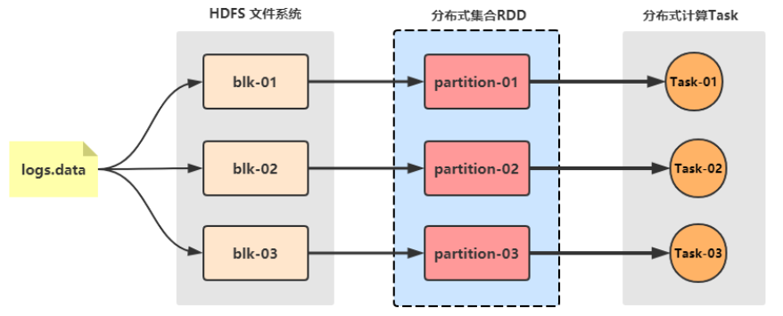

# Spark 框架概述

## Spark 是什么

Unified engine for large-scale data analytics.

用于**大规模数据**（large-scala data）分析的**统一（unified）引擎**。

Apache Spark™ is a multi-language engine for executing data engineering, data science, and machine learning on single-node machines or clusters. 

Apache Spark™ 是一个**多语言引擎**，用于在单节点机器或集群上执行**数据工程**、**数据科学**和**机器学习**。

Spark 最早源于一篇论文 Resilient Distributed Datasets: A Fault-Tolerant Abstraction for In-Memory Cluster Computing，该论文是由加州大学柏克莱分校的 Matei Zaharia 等人发表的。论文中提出了一种**弹性分布式数据集（即 RDD）**的概念。

RDD 是一种分布式内存抽象，其使得程序员能够在大规模集群中做内存运算，并且有一定的容错方式。而这也是整个 Spark 的核心数据结构，Spark 整个平台都围绕着 RDD 进行。

Spark 借鉴了 MapReduce 思想发展而来，保留了其分布式并行计算的优点并改进了其明显的缺陷。让中间数据存储在内存中提
高了运行速度、并提供丰富的操作数据的API提高了开发速度。

Spark 与 MapReduce 比较：Spark 为什么比MapReduce计算要快？

| 比较方面      | MapRedue 计算引擎                  | Spark 计算引擎                                               |
| ------------- | ---------------------------------- | ------------------------------------------------------------ |
| Job 程序结构  | 1 个Map Stage + 1个 Reduce Stage   | RDD组成DAG有向无环图，多个Stage  多个Map Stage + 多个Redue Stage |
| 中间结果存储  | 本地磁盘Disk                       | 没有Shuffle时，存储内存Memory                                |
| Task 运行方式 | 进程Process：MapTask 和Reduce Task | 线程Thread：Task，无需频繁启动和销毁                         |
| 程序编程模型  | 直接读取文件数据，map + reduce     | 文件数据封装：RDD，调用函数处理                              |

Spark是一款分布式内存计算的统一分析引擎。其特点就是对任意类型的数据进行自定义计算。

Spark可以计算：结构化、半结构化、非结构化等各种类型的数据结构，同时也支持使用Python、Java、Scala、R以及SQL语言去开发应用程序计算数据。

Spark的适用面非常广泛，所以，被称之为 统一的（适用面广）的分析引擎（数据处理）。

## Spark 风雨十年

Spark 是加州大学伯克利分校AMP实验室（Algorithms Machines and People Lab）开发的通用大数据处理框架。

* 2009年Spark诞生于伯克利AMPLab，伯克利大学的研究性项目
* 2010年通过BSD 许可协议正式对外开源发布
* 2012年Spark第一篇论文发布，第一个正式版（Spark 0.6.0）发布
* 2013年Databricks公司成立并将Spark捐献给Apache软件基金会
* 2014年2月成为Apache顶级项目，同年5月发布Spark 1.0正式版本
* 2015年引入DataFrame大数据分析的设计概念
* 2016年引入DataSet更强大的数据分析设计概念并正式发布Spark2.0
* 2017年Structured streaming 发布，统一化实时与离线分布式计算平台
* 2018年Spark2.4.0发布，成为全球最大的开源项目
* 2019年11月Spark官方发布3.0预览版
* 2020年6月Spark发布3.0.0正式版

Stack Overflow的数据可以看出，2015年开始Spark每月的问题提交数量已经超越Hadoop，而2018年Spark Python版本的API
PySpark每月的问题提交数量也已超过Hadoop。2019年排名Spark第一，PySpark第二；而十年的累计排名是Spark第一，PySpark第
三。按照这个趋势发展下去，Spark和PySpark在未来很长一段时间内应该还会处于垄断地位。

## Spark 的特点

Spark具有运行速度快、易用性好、通用性强和随处运行等特点。

* 速度快

由于Apache Spark支持内存计算，并且通过DAG（有向无环图）执行引擎支持无环数据流，所以官方宣称其在内存中的运算速度要比
Hadoop的MapReduce快100倍，在硬盘中要快10倍。

> Spark处理数据与MapReduce处理数据相比，有如下两个不同点：
> 其一、Spark处理数据时，可以将中间处理结果数据存储到内存中；
> 其二、Spark 提供了非常丰富的算子(API)，可以做到复杂任务在一个Spark 程序中完成。

* 易用性好

Spark 的版本已经更新到 Spark 3.2.1（截止日期2022.1.26），支持了包括 Java、Scala、Python 、R和SQL语言在内的多种语言。为了
兼容Spark2.x企业级应用场景，Spark仍然持续更新Spark2版本。

* 通用性强

在 Spark 的基础上，Spark 还提供了包括Spark SQL、Spark Streaming、MLib 及GraphX在内的多个工具库，我们可以在一个应用中无缝地使用这些工具库。

* 随处运行

Spark 支持多种运行方式，包括在 Hadoop 和 Mesos 上，也支持 Standalone的独立运行模式，同时也可以运行在云Kubernetes（Spark 2.3开始支持）上。

另外，Spark还有一些其他的特点。

* **批处理/流数据**：使用您的首选语言（Python，SQL，Scala，Java或R）以批处理和实时流方式统一数据处理。
* **SQL 分析**：执行快速、分布式的 ANSI SQL 查询，用于仪表板和即席报告。运行速度比大多数数据仓库都快。
* **大规模数据科学**：对 PB 级数据执行探索性数据分析 （EDA），而无需采用缩减采样。
* **机器学习**：在笔记本电脑上训练机器学习算法，并使用相同的代码扩展到数千台计算机的容错群集。

## Spark 生态系统

Apache Spark™ 可以与您最喜爱的框架集成，帮助将它们扩展到数千台计算机。

## Spark 的运行模式

Spark提供多种运行模式，包括：

* 本地模式（单机）

本地模式就是以一个**独立的进程**，通过其内部的**多个线程来模拟**整个Spark运行时环境。

* Standalone模式（集群）

Spark中的各个角色以**独立进程**的形式存在，并组成Spark集群环境。

* Hadoop YARN模式（集群）

Spark中的各个角色运行在**YARN的容器内部**，并组成Spark集群环境。

* Kubernetes模式（容器集群）

Spark中的各个角色运行在**Kubernetes的容器内部**，并组成Spark集群环境。

* 云服务模式（运行在云平台上）

## Spark 的架构角色

### Yarn 角色回顾

Yarn主要有4类角色，从2个层面去看：

资源管理层面

* 集群资源管理者（Master）：ResourceManager
* 节点资源管理者（Worker）：NodeManager

任务执行层面

* 单任务管理者（Master）：ApplicationMaster
* 单任务执行者（Worker）：Task

### Spark 运行角色

Spark中由4类角色组成整个运行时环境

* Master角色，管理整个集群的资源。类比Yarn的ResourceManager。
* Worker角色，管理单个节点上的资源。类比Yarn的NodeManager。
* Driver角色，单个Spark任务运行时的管理者。类比Yarn的ApplicationMaster。
* Executor角色，单个Spark任务运行时的多个工作者。类比Yarn的Task。

从2个层面划分：

资源管理层面

* 管理者：Spark中是Master，Yarn中是ResourceManager
* 工作者：Spark中是Worker，Yarn中是NodeManager

任务执行层面

* 单任务管理者：Spark中是Driver，Yarn中是ApplicationMaster
* 单任务执行者：Spark中是Executor，Yarn中是Task

