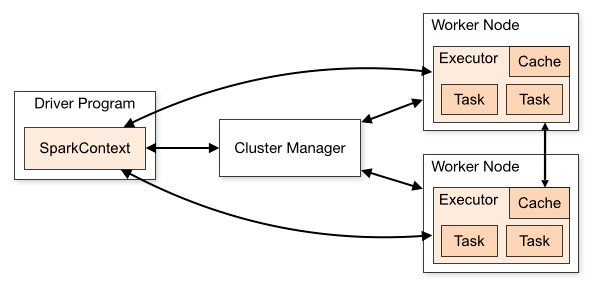
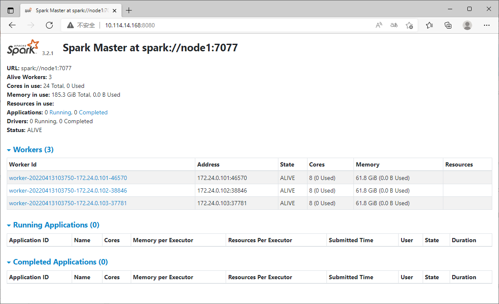
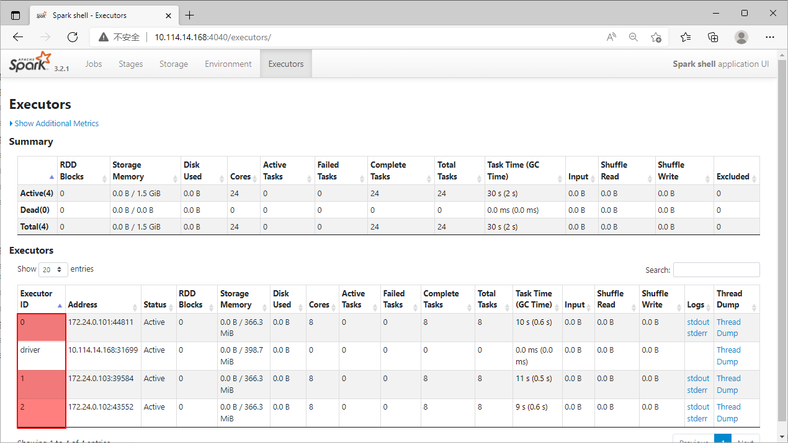
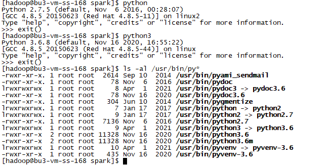
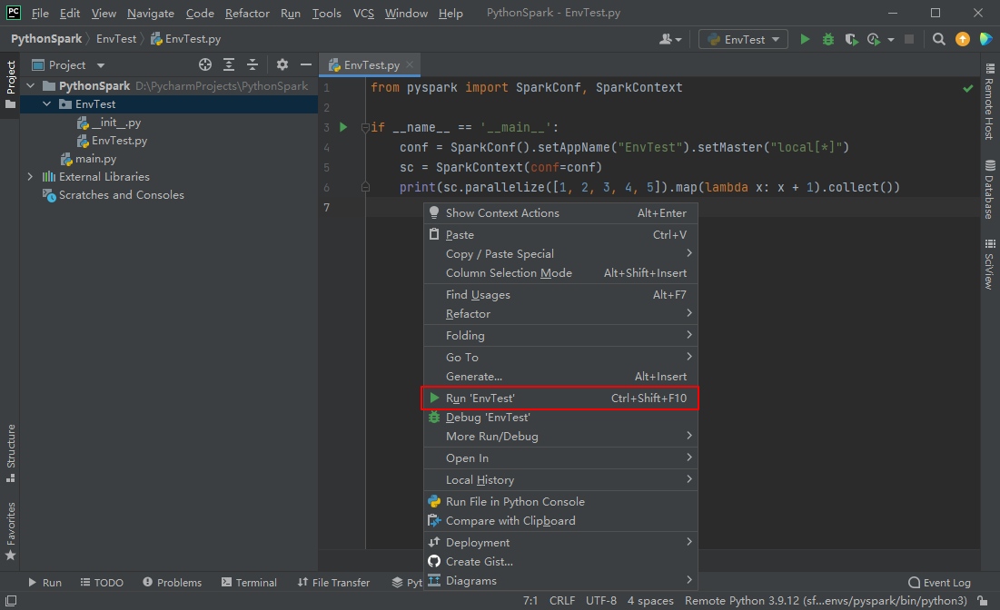
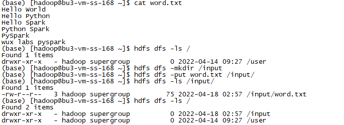

# Spark 环境搭建

## Spark 安装程序下载

首先通过Spark的官方网站[https://spark.apache.org/downloads.html](https://spark.apache.org/downloads.html)下载Spark的安装程序。


或者直接通过下载链接[https://www.apache.org/dyn/closer.lua/spark/spark-3.2.1/spark-3.2.1-bin-hadoop3.2.tgz](https://www.apache.org/dyn/closer.lua/spark/spark-3.2.1/spark-3.2.1-bin-hadoop3.2.tgz)进行下载。

将下载好的安装程序放置到softs目录下。


## Local 模式搭建

### 基本原理

本质：**启动一个JVM Process进程(一个进程里面有多个线程)，执行任务Task**。

* Local模式可以限制模拟Spark集群环境的线程数量，即Local[N] 或 Local[\*]。
* 其中N代表可以使用N个线程，每个线程拥有一个CPU Core。如果不指定N，则默认是1个线程（该线程有1个core）。 通常CPU有几个Core，就指定几个线程，最大化利用计算能力。
* 如果是local[*]，则代表 Run Spark locally with as many worker threads as logical cores on your machine。按照CPU最多的Cores设置线程数。

Local 下的角色分布：

资源管理：

* Master：Local进程本身
* Worker：Local进程本身

任务执行：

* Driver：Local进程本身
* Executor：不存在，没有独立的Executor角色，而是由Local进程(也就是Driver)内的线程提供计算能力

> Driver也算一种特殊的Executor，只不过多数时候，我们将Executor当做纯Worker对待，这样和Driver好区分  
> 注意：Local模式只能运行一个Spark程序，如果执行多个Spark程序，那就是由多个相互独立的Local进程在执行

### 环境搭建

开箱即用：**解压安装包之后，直接运行bin目录下的相关命令即可**。

创建apps目录，并将Spark安装包解压到apps目录下。

```
mkdir -p apps
tar -xzf softs/spark-3.2.1-bin-hadoop3.2.tgz -C apps/
ls -al apps/
```


切换到Spark的安装路径下。

```
cd ~/apps/spark-3.2.1-bin-hadoop3.2
ls -al
```


### 环境验证

#### 测试spark-shell

spark-shell 程序，可以提供一个交互式的 Scala 解释器环境，在这里面可以用 Scala 语言调用 Spark API 进行计算。

```
bin/spark-shell
```


* Spark Web UI：http://10.114.14.168:4040
* Spark 版本：version 3.2.1
* Scala 版本：Scala version 2.12.15
* sc：SparkContext实例对象
* spark：SparkSession实例对象
* 4040：Web监控页面端口号

```
scala> sc.parallelize(List(1,2,3,4,5)).map(x => x * 2).collect()
```


#### 测试pyspark

pyspark程序，可以提供一个交互式的 Python 解释器环境，在这里面可以用 Python 语言调用 Spark API 进行计算。

```
bin/pyspark
```


* Spark Web UI：http://10.114.14.168:4040
* Spark 版本：version 3.2.1
* Python 版本：Python version 3.6.8
* sc：SparkContext实例对象
* spark：SparkSession实例对象
* 4040：Web监控页面端口号

```
>>> sc.parallelize([1,2,3,4,5]).map(lambda x: x + 1).collect()
```


#### 测试Spark Web UI

访问http://10.114.14.168:4040。


通过上面的界面，我们可以看到提交的job。


在Executors页面，我们可以发现仅有一个Driver程序。因为我们是Local模式，Driver即管理又干活。

同时，输入jps可以看到local模式下的唯一进程存在，这个进程既是master也是worker。


#### 测试spark-submit

spark-submit程序，作用：提交指定的Spark代码到Spark环境中运行。

语法：

```
bin/spark-submit [可选的一些选项] jar包或者Python代码的路径 [代码的参数]
```

示例：

```
bin/spark-submit --class org.apache.spark.examples.SparkPi examples/jars/spark-examples_2.12-3.2.1.jar 10
```

```
bin/spark-submit examples/src/main/python/pi.py 10
```

#### spark-shell/pyspark/spark-submit 对比

| 程序     | spark-shell                                                  | pyspark                                                      | spark-submit                               |
| -------- | ------------------------------------------------------------ | ------------------------------------------------------------ | ------------------------------------------ |
| 功能     | 提供一个交互式的 Scala 解释器环境，在这里面可以用 Scala 语言调用 Spark API 进行计算。 | 提供一个交互式的 Python 解释器环境，在这里面可以用 Python 语言调用 Spark API 进行计算。 | 提交指定的Spark代码到Spark环境中运行。     |
| 特点     | 交互式环境，写一行执行一行                                   | 交互式环境，写一行执行一行                                   | 提交代码用                                 |
| 使用场景 | 学习/测试/交互式验证等                                       | 学习/测试/交互式验证等                                       | 生产场景/正式场合，正式提交Spark程序运行。 |

## Standalone 模式搭建

### 基本原理

Standalone模式是Spark自带的一种集群模式，不同于本地模式启动多个进程来模拟集群的环境，Standalone模式是真实地在多个机器之间搭建Spark集群的环境，完全可以利用该模式搭建多机器集群，用于实际的大数据处理。

Standalone 是完整的Spark运行环境，其中：

* Master角色以Master进程存在
* Worker角色以Worker进程存在
* Driver运行在Master进程内，Executor运行于Worker进程内

Spark架构设计将资源管理单独抽象出一层Cluster Manager，通过这种抽象能够构建一种适合企业当前技术栈的插件式资源管理模块，从而为不同的计算场景提供不同的资源分配与调度策略。



Cluster Manager支持：Standalone、Yarn、Mesos……

Standalone集群在进程上主要有3类进程：

* 主节点Master进程：Master角色，管理整个集群资源，并托管运行各个任务的Driver
* 从节点Workers：Worker角色，管理每个机器的资源，分配对应的资源来运行Executor(Task)；每个从节点分配资源信息给Worker管理，资源信息包含内存Memory和CPU Cores核数
* 历史服务器HistoryServer(可选)：Spark Application运行完成以后，保存事件日志数据至HDFS，启动HistoryServer可以查看应用运行相关信息

### 环境搭建

由于Standalone需要多台服务器，一般至少3台服务器，但是我们并没有多台服务器可用，所以环境搭建我们采用Docker容器进行搭建。我们采用3个Docker容器进行集群搭建，并且需要保证3个容器在同一个网络内。

| 容器名称 | 容器IP       |
| -------- | ------------ |
| node1    | 172.24.0.101 |
| node2    | 172.24.0.102 |
| node3    | 172.24.0.103 |

Standalone 集群的搭建，需要完成以下配置文件的配置：

`conf/workers` ：

```
node1
node2
node3
```

`conf/spark-env.sh`：

```
# 设置 Java 安装目录
JAVA_HOME=/home/hadoop/apps/java

# 指定 Spark Master 的 IP 和提交任务的通信端口
# 告知 Spark Master运行在哪个机器上
SPARK_MASTER_HOST=node1
# 告知 Spark Master 的通讯端口
SPARK_MASTER_PORT=7077
# 告知 Spark Master 的 WebUI 端口
SPARK_MASTER_WEBUI_PORT=8080

# 指定 Spark 的日志存放路径
SPARK_LOG_DIR=/home/hadoop/logs/spark
# 指定 Spark 的工作路径
SPARK_WORKER_DIR=/home/hadoop/works/spark
```

集群的启动我们使用 `start-all.sh` 命令。

具体步骤参照[实验2 Spark Standalone模式搭建](../Labs/实验2 Spark Standalone模式搭建.md)。

### 环境验证

#### 测试Master Web UI

我们在浏览器中访问我们配置的端口，就可以打开 Web UI 了。



#### 测试spark-shell

我们在宿主机上执行 spark-shell ，此时，与 Local 模式不同，我们需要指定 --master 选项，以让 spark-shell 连接到集群环境。

```
cd /home/hadoop/apps/spark

bin/spark-shell --master spark://node1:7077
```


可以看到，在 Local 模式下，master = local[*]，而在 Standalone 集群模式下，master = spark://node1:7077。并且我们可以在 Master Web UI 界面看到我们的应用。


我们运行一段代码

```
scala> sc.parallelize(List(1,2,3,4,5)).map(x => x * 2).collect()
```


通过点击 Master Web UI 界面的 Application ID 可以跳转到应用的界面。


在这里，我们可以看到总共有3个 Executor。


点击界面上的 Application Detail UI，可以跳转到端口为 4040 的监控界面。


在监控界面，我们可以看到刚才运行的代码的详细信息、DAG图等。


在 Executors 界面，我们可以看到，除了 driver，还有另外 3 个 Executor 存在。



Spark Application运行到集群上时，由两部分组成：Driver Program和Executors。

**Driver Program**

* 相当于AppMaster，整个应用管理者，负责应用中所有Job的调度执行
* 运行JVM Process，运行程序的main函数，必须创建SparkContext上下文对象
* 一个Spark Application仅有一个Driver

**Executors**

* 相当于一个线程池，运行JVM Process，其中有很多线程，每个线程运行一个Task任务，一个Task任务运行需要1 Core CPU，所以可以认为Executor中线程数就等于CPU Core核数
* 一个Spark Application可以有多个Executor，可以设置个数和资源信息

用户程序从最开始的提交到最终的计算执行，需要经历以下几个阶段： 

* 用户程序创建 SparkContext 时，新创建的 SparkContext 实例会连接到 ClusterManager。 ClusterManager 会根据用户提交时设置的 CPU 和内存等信息为本次提交分配计算资源，启动 Executor
* Driver会将用户程序划分为不同的执行阶段，每个执行阶段由一组Task组成，这些Task分别作用于待处理数据的不同分区。在阶段划分完成和Task创建后，Driver会向Executor发送Task
* Executor在接收到Task后，会下载Task的运行时依赖，在准备好Task的执行环境后，会开始执行Task，并且将Task的运行状态汇报给Driver
* Driver会根据收到的Task的运行状态来处理不同的状态更新。 Task分为两种：
  * Shuffle Map Task，它实现数据的重新Shuffle，Shuffle的结果保存到Executor所在节点的文件系统中
  * Result Task，它负责生成结果数据
* Driver会不断地调用Task，将Task发送到Executor执行，在所有的Task都正确执行或者超过执行次数的限制仍然没有执行成功时停止

Spark Application程序运行时三个核心概念：Job、Stage、 Task

* Job：由多个Task的并行计算部分，一般Spark中的action操作，会生成一个Job
* Stage：Job的组成单位，一个Job会切分成多个Stage，Stage彼此之间相互依赖顺序执行，而每个Stage是多个Task的集合，类似map和reduce
* Task：被分配到各个Executor的单位工作内容，它是Spark中的最小执行单位，一般来说有多少个Paritition，就会有多少个Task，每个Task只会处理单个Paritition上的数据

前面我们接触到的监控页面，有4040，有8080。

* 4040 是一个运行的Application在运行的过程中临时绑定的端口，用以查看当前任务的状态，当前程序运行完成后，4040就会被注销
* 8080 是Standalone模式下Master的Web端口，用以查看当前Master(集群)的状态

#### 测试 spark-submit

我们在宿主机上执行 spark-submit ，此时，与 Local 模式不同，我们需要指定 --master 选项，以让 pyspark 连接到集群环境。

```
bin/spark-submit --master spark://node1:7077 --class org.apache.spark.examples.SparkPi examples/jars/spark-examples_2.12-3.2.1.jar 10
```


可以看到，在 Local 模式下，master = local[*]，而在 Standalone 集群模式下，master = spark://node1:7077。并且我们可以在 Master Web UI 界面看到我们的应用。


#### 测试 pyspark

我们在宿主机上执行 pyspark ，此时，与 Local 模式不同，我们需要指定 --master 选项，以让 pyspark 连接到集群环境。

```
bin/pyspark --master spark://node1:7077
```


可以看到，在 Local 模式下，master = local[*]，而在 Standalone 集群模式下，master = spark://node1:7077。并且我们可以在 Master Web UI 界面看到我们的应用。


我们执行一段代码。

```
>>> sc.parallelize([1,2,3,4,5]).map(lambda x: x + 1).collect()
```


通过代码运行，我们可以看到，报错了！

因为 pyspark 会依赖 Python 环境，但是我们的3个 Docker 容器内并没有安装 Python 环境，所以无法进行执行。而在 Local 模式下，由于是在宿主机本地执行，而宿主机是安装了 Python 的，所以 Local 模式并没有导致报错。



完整安装的 Linux 系统，默认会自带 Python2 的环境，并且我们自己还安装了 Python3，所以本地不会报错。但是 Docker 环境并没有自带的 Python 环境，所以需要我们自己安装，但是前面的所有步骤都未涉及到 Python 环境的安装。这个问题我们放在后面来解决。

## Spark on Yarn 模式搭建

过在企业中，服务器的资源总是紧张的，许多企业基本上都有Hadoop集群，也就是有Yarn集群。在已有Yarn集群的前提下再单独准备Spark Standalone集群，对资源的利用就不高。所以，多数场景下会将Spark运行到Yarn集群上。

### 基本原理

Yarn本身是一个资源调度框架，负责对运行在内部的计算框架进行资源调度管理。作为典型的计算框架，Spark本身也可以直接运行在Yarn中，并接受Yarn的调度的。所以，对于Spark on Yarn，无需部署Spark集群，只要找一台服务器充当Spark的客户端，即可提交任务到Yarn集群中运行。

Spark On Yarn的本质

* Master角色由Yarn的ResourceManager担任
* Worker角色由Yarn的NodeManager担任
* Driver角色运行在Yarn容器内 或 提交任务的客户端进程中
* Executor运行在Yarn提供的容器内

Spark On Yarn需要啥

* 需要Yarn集群
* 需要Spark客户端工具，比如spark-submit，可以将Spark程序提交到Yarn中

### 环境搭建

首先我们需要安装Hadoop集群、启动HDFS、启动Yarn。

由于Spark on Yarn不需要启动Spark集群，而是在接收到客户端请求后由Yarn进行资源分配并启动程序，所以需要Yarn的每个节点都能访问到Spark的依赖库，所以最好是每个Yarn节点上都放置Spark的安装程序。

由于pyspark的运行要依赖于Python3的环境，所以每个节点都需要安装Python3。

我们依然采样Docker容器、目录挂载的方式来搭建Spark on Yarn环境。这次我们使用5台服务器，即使用5个Docker容器来进行搭建，并且需要保证5个容器在同一个网络内。

| 容器名称 | 容器IP       |
| -------- | ------------ |
| node1    | 172.24.0.101 |
| node2    | 172.24.0.102 |
| node3    | 172.24.0.103 |
| node4    | 172.24.0.104 |
| node5    | 172.24.0.105 |

我们在宿主机本地安装 Python3（使用Anaconda）、Hadoop，并配置Hadoop的配置文件，并且需要在Spark的配置文件中配置HADOOP_CONF_DIR和YARN_CONF_DIR，其余的配置可以不要。

宿主机作为客户机，需要将环境变量设置为与容器中的环境变量一致。

具体步骤参照[实验3 Spark on Yarn模式搭建](../Labs/实验3 Spark on Yarn模式搭建.md)。

### 环境验证

#### 测试 HDFS

我们在Hadoop的配置文件中，没有指定HDFS的Web端口，Hadoop 3默认使用的是9870，并且我们已经映射到了宿主机。打开浏览器看看。


#### 测试 Yarn

我们可以通过端口 8088 打开Yarn的Web UI。


#### 测试 spark-shell

我们在宿主机上执行 spark-shell ，此时，我们需要指定 --master 选项，以让 spark-shell 连接到集群环境。

```
cd /home/hadoop/apps/spark

bin/spark-shell --master yarn --deploy-mode client
```


在Yarn的界面，我们可以看到提交的程序。


我们运行一段代码

```
scala> sc.parallelize(List(1,2,3,4,5)).map(x => x * 2).collect()
```


#### 测试 spark-submit

我们在宿主机上执行 spark-submit ，此时，我们需要指定 --master 选项，以让 spark-submit 连接到集群环境。

##### Client 模式

在执行时指定 `--deploy-mode client`

```
bin/spark-submit --master yarn --deploy-mode client --class org.apache.spark.examples.SparkPi examples/jars/spark-examples_2.12-3.2.1.jar 10
```

我们可以在 Yarn 的 Web UI 界面看到我们的应用。


##### Cluster 模式

在执行时指定 `--deploy-mode cluster`

```
bin/spark-submit --master yarn --deploy-mode cluster --class org.apache.spark.examples.SparkPi examples/jars/spark-examples_2.12-3.2.1.jar 10
```

通过Yarn Web UI还是可以看到我们的应用的。


#### 测试 pyspark

我们在宿主机上执行 pyspark ，此时，我们需要指定 --master 选项，以让 pyspark 连接到集群环境。

```
bin/pyspark --master yarn --deploy-mode client
```


我们可以在 Yarn Web UI 界面看到我们的应用。


我们执行一段代码。

```
>>> sc.parallelize([1,2,3,4,5]).map(lambda x: x + 1).collect()
```


### 部署模式DeployMode

Spark on Yarn是有两种运行模式的：

* 一种是Cluster模式
* 一种是Client模式。

这两种模式的区别就是Driver运行的位置：

* Cluster模式：Driver运行在Yarn容器内部，和ApplicationMaster在同一个容器内
* Client模式：Driver运行在客户端进程中，比如Driver运行在spark-submit程序的进程中

从前面的验证过程，我们可以看到，在Spark on Yarn模式下：

* spark-submit程序既可以使用Client模式，也可以使用Cluster模式
* 但是：spark-shell和pyspark，因为是交互式运行的，所以只支持Client模式，不支持Cluster模式

两种模式的区别：

|                | Cluster模式                  | Client模式                               |
| -------------- | ---------------------------- | ---------------------------------------- |
| Driver运行位置 | Yarn容器内                   | 客户端进程内                             |
| 通讯效率       | 高                           | 低于Cluster模式                          |
| 日志查看       | 日志输出在容器内, 查看不方便 | 日志输出在客户端的标准输出流中，方便查看 |
| 生产可用       | 推荐                         | 不推荐                                   |
| 稳定性         | 稳定                         | 基于客户端进程，受到客户端进程影响       |

Client模式和Cluster模式最最本质的区别是：Driver程序运行在哪里。 

* Client模式：学习测试时使用，生产不推荐(要用也可以，性能略低，稳定性略低) 
  * Driver运行在Client上，和集群的通信成本高
  * Driver输出结果会在客户端显示
* Cluster模式：生产环境中使用该模式
  * Driver程序在Yarn集群中，和集群的通信成本低
  * Driver输出结果不能在客户端显示
  * 该模式下Driver运行ApplicationMaster这个节点上，由Yarn管理，如果出现问题，Yarn会重启 ApplicationMaster(Driver)

#### 两种模式详细流程

##### Client 模式

在Yarn Client模式下，Driver在任务提交的本地机器上运行（客户端，案例中的宿主机）。

1. Driver在任务提交的本地机器上运行，Driver启动后会和ResourceManager通讯申请启动ApplicationMaster
2. ResourceManager分配Container，在合适的NodeManager上启动ApplicationMaster，此时的ApplicationMaster的功能相当于一个ExecutorLaucher，只负责向ResourceManager申请Executor内存
3. ResourceManager接到ApplicationMaster的资源申请后会分配Container，然后ApplicationMaster在资源分配指定的NodeManager上启动Executor进程
4. Executor进程启动后会向Driver反向注册，Executor全部注册完成后Driver开始执行main函数
5. 之后执行到Action算子时，触发一个Job，并根据宽窄依赖开始划分Stage，每个Stage生成对应的TaskSet，之后将Task分发到各个Executor上执行

##### Cluster 模式

在Yarn Cluster模式下，Driver运行在NodeManager Container中，此时Driver与ApplicationMaster合为一体。

1. 任务提交后会和ResourceManager通讯申请启动ApplicationMaster
2. 随后ResourceManager分配Container，在合适的NodeManager上启动ApplicationMaster，此时的ApplicationMaster就是Driver
3. Driver启动后向ResourceManager申请Executor内存，ResourceManager接到ApplicationMaster的资源申请后会分配Container，然后在合适的NodeManager上启动Executor进程
4. Executor进程启动后会向Driver反向注册
5. Executor全部注册完成后Driver开始执行main函数，之后执行到Action算子时，触发一个Job，并根据宽窄依赖开始划分Stage，每个Stage生成对应的TaskSet，之后将Task分发到各个Executor上执行

## 本机开发环境搭建

前面完成了服务器的运行环境搭建，下面来看看本机开发环境如何搭建，毕竟代码需要先在本机开发才能提交到服务器运行。

### PyCharm 安装

PyCharm是一种Python IDE（Integrated Development Environment，集成开发环境），带有一整套可以帮助用户在使用Python语言开发时提高其效率的工具，比如调试、语法高亮、项目管理、代码跳转、智能提示、自动完成、单元测试、版本控制等。因此我们使用PyCharm来进行相关程序的开发。

根据自身情况，自行下载[https://www.jetbrains.com/pycharm/download/#section=windows](https://www.jetbrains.com/pycharm/download/#section=windows)相应的版本，完成安装。

### 创建项目并配置运行环境

打开刚安装好的PyCharm，通过点击Projects -> New Project 来进行项目的创建。


选择Pure Python项目，设置Location，在设置Python虚拟环境的地方我们选择新建一个。


在配置项目的Python运行环境时，我们除了在本地安装Python外，还可以直接使用远程Linux服务器上的Python环境及解释器等。

### 开发测试

#### Local 模式运行

我们开发一段代码来进行环境测试。

```python
from pyspark import SparkConf, SparkContext

if __name__ == '__main__':
    conf = SparkConf().setAppName("EnvTest").setMaster("local[*]")
    sc = SparkContext(conf=conf)
    print(sc.parallelize([1, 2, 3, 4, 5]).map(lambda x: x + 1).collect())
```

然后，右键运行。



#### Yarn 模式运行

修改代码，设置master=yarn来试试。

```python
from pyspark import SparkConf, SparkContext

if __name__ == '__main__':
    conf = SparkConf().setAppName("EnvTest").setMaster("yarn")
    sc = SparkContext(conf=conf)
    print(sc.parallelize([1, 2, 3, 4, 5]).map(lambda x: x + 1).collect())
```

然后右键运行。


#### WordCount 案例

接下来我们来看看如何访问HDFS上的文件。

> 由于我们的宿主机跟Docker的环境配置完全一致，并且宿主机可以直接连接Docker容器，所以直接把宿主机当Hadoop的客户端，直接执行相关命令即可。

首先我们创建一个文件`word.txt`

```
Hello World
Hello Python
Hello Spark
Python Spark
PySpark
wux labs pyspark
```

然后将文件上传到HDFS的input目录下。



接下来开发一段WordCount代码。

```python
from pyspark import SparkConf, SparkContext

if __name__ == '__main__':
    print('PySpark WordCount Program')
    # TODO: 当应用运行在集群上的时候，MAIN函数就是Driver Program，必须创建SparkContext对象
    # 创建SparkConf对象，设置应用的配置信息，比如应用名称和应用运行模式
    conf = SparkConf().setAppName("WordCount").setMaster("yarn")
    # TODO: 构建SparkContext上下文实例对象，读取数据和调度Job执行
    sc = SparkContext(conf=conf)
    # 第一步、读取本地数据 封装到RDD集合，认为列表List
    wordsRDD = sc.textFile("hdfs://node1:8020/input/word.txt")
    # 第二步、处理数据 调用RDD中函数，认为调用列表中的函数
    # a. 每行数据分割为单词
    flatMapRDD = wordsRDD.flatMap(lambda line: line.split(" "))
    # b. 转换为二元组，表示每个单词出现一次
    mapRDD = flatMapRDD.map(lambda x: (x, 1))
    # c. 按照Key分组聚合
    resultRDD = mapRDD.reduceByKey(lambda a, b: a + b)
    # 第三步、输出数据
    print(resultRDD.collect())
    # 输出到本地文件中
    resultRDD.saveAsTextFile("hdfs://node1:8020/output/count")
    print('停止 PySpark SparkSession 对象')
    # 关闭SparkContext
    sc.stop()
```

然后运行。


#### 本地调试程序

我们修改一下程序的输出路径，然后给代码打几个断点，右键进行Debug。


### 总结

安装好Linux服务器上的环境之后，本机开发环境可以不用安装Python，直接使用远程Linux上的环境运行即可。这有几点好处：

* 开发环境与运行环境完全保持一致，可避免Windows与Linux版本差异导致的一些Bug
* 可以直接将本机开发的程序运行在yarn上，直接就是基于yarn环境在进行开发，最大程度的将开发与生产环境保持一致
* 可以直接调试代码，并且是基于yarn运行环境在进行代码调试

当然这种方式也有一些要求：

* 本机需要随时与远程Linux保持连接，一旦连接断开，本地代码无法运行
