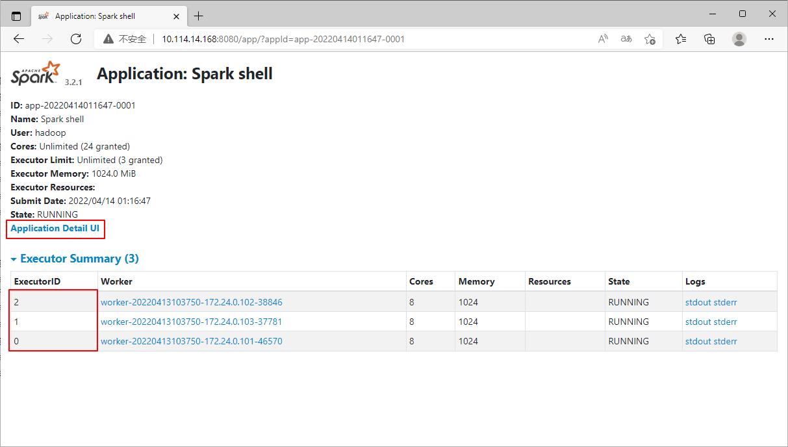
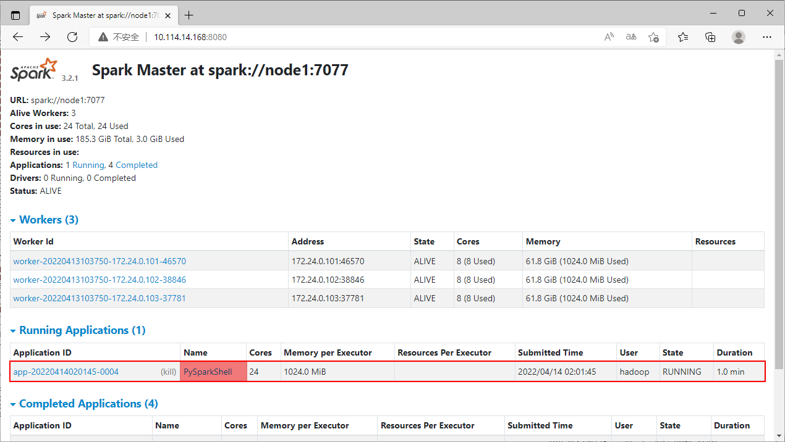
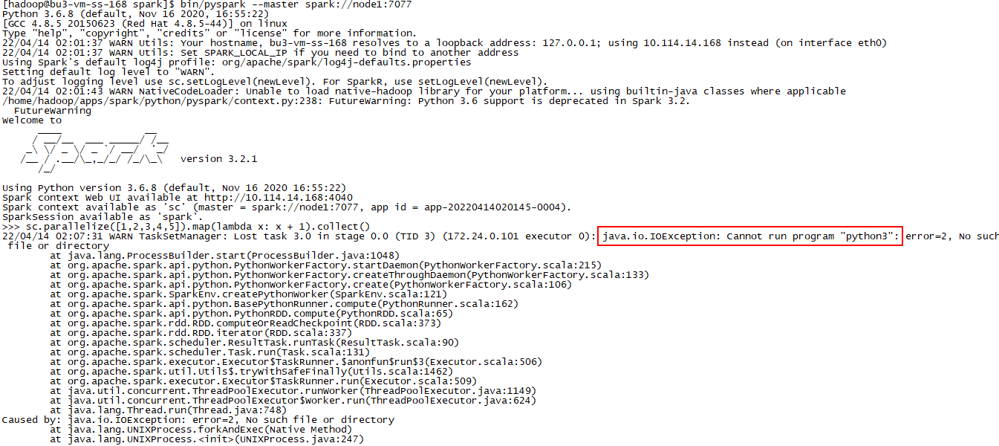

# 实验2 Spark Standalone模式搭建

本实验主要是搭建Standalone模式的Spark集群。

本实验需要先完成 [实验1 Spark Local模式搭建](实验1 Spark Local模式搭建.md)。

本实验基于Docker镜像进行集群环境搭建，Docker镜像制作完成后，即可启动任意数量的容器来启动集群。

开始实验之前，请确保服务器上安装了Docker环境，创建了docker用户。

## 环境规划

本次实验采用3个Docker容器进行集群搭建，并且需要保证3个容器在同一个网络内。

| 容器名称 | 容器IP       |
| -------- | ------------ |
| node1    | 172.24.0.101 |
| node2    | 172.24.0.102 |
| node3    | 172.24.0.103 |

## 任务1 Docker 镜像制作

### 步骤1 制作 Dockerfile 文件

**以下步骤需要在宿主机上使用 `docker` 用户进行操作。**

环境说明：

* 使用centos作为底层系统
* 需要配置节点之间的免密登录，所以需要安装ssh服务
* 为了减小镜像的体积，镜像以及启动的容器内并不直接安装相关软件，而是将相关软件安装在宿主机，并将宿主机的安装路径挂载到容器，而且通过挂载的方式，我们修改配置文件只需要在宿主机上修改就可以了，无需手动同步到所有节点，所以要求 `容器内的路径与宿主机的路径完全保持一致` 。因为宿主机的Spark使用 `hadoop` 用户安装在 `/home/hadoop/apps` 路径下，所以，Docker容器同样使用 `hadoop` 用户，并创建挂载点 `/home/hadoop/apps` 用于挂载宿主机的路径。
* 容器内的部署用户使用 `hadoop` 用户，并配置节点间的免密登录。
* 为用户配置好相关的环境变量
* 创建挂载点 `~/apps` 用于挂载安装程序，创建预留挂载点 `~/logs` 用于存放日志文件、`~/works` 用于程序运行的工作目录、`~/softs` 用于存放一些需要提交到容器内部进行安装、运行的程序。

创建Dockerfile文件`SparkStandalone`：

```
FROM centos:centos7.6.1810

MAINTAINER wux_labs wux_labs@outlook.com

# 安装sshd服务
RUN mkdir /var/run/sshd

RUN yum -y install net-tools openssl openssh-server openssh-clients which sudo

RUN sed -i 's/#PermitRootLogin yes/PermitRootLogin yes/g' /etc/ssh/sshd_config
RUN sed -i 's/#RSAAuthentication yes/RSAAuthentication yes/g' /etc/ssh/sshd_config
RUN sed -i 's/#PubkeyAuthentication yes/PubkeyAuthentication yes/g' /etc/ssh/sshd_config

RUN ssh-keygen -t dsa -f /etc/ssh/ssh_host_dsa_key
RUN ssh-keygen -t rsa -f /etc/ssh/ssh_host_rsa_key
RUN ssh-keygen -t ecdsa -b 256 -f /etc/ssh/ssh_host_ecdsa_key
RUN ssh-keygen -t ed25519 -b 256 -f /etc/ssh/ssh_host_ed25519_key

RUN echo "root   ALL=(ALL)     ALL" >> /etc/sudoers

# 创建用户和组
RUN groupadd hadoop
RUN useradd -g hadoop hadoop

USER hadoop

# 为hadoop用户设置节点间的免密登录
RUN ssh-keygen -t rsa -f ~/.ssh/id_rsa
RUN cp ~/.ssh/id_rsa.pub ~/.ssh/authorized_keys

# 配置环境变量
RUN echo $'export JAVA_HOME=/home/hadoop/apps/java\n\
export SPARK_HOME=/home/hadoop/apps/spark\n\
export PATH=$JAVA_HOME/bin:$SPARK_HOME/bin:$SPARK_HOME/sbin:$PATH\n\
' >> ~/.bashrc

RUN mkdir -p ~/apps ~/logs ~/softs ~/works
VOLUME ["/home/hadoop/apps","/home/hadoop/logs","/home/hadoop/softs","/home/hadoop/works"]

USER root

# 容器一运行就启动sshd服务
CMD ["/usr/sbin/sshd","-D"]
```


### 步骤2 构建 Docker 镜像

执行以下命令，通过Dockerfile构建镜像：

```
docker build --no-cache -f SparkStandalone -t wux_labs/spark:3.2.1 .

docker images | grep wux_labs
```


## 任务2 宿主机环境配置

**以下步骤需要在宿主机上使用 `hadoop` 用户进行操作。**

由于环境采用的是挂载宿主机文件的方式，所以宿主机的文件结构需要与容器内的结构匹配。

我们首先看看宿主机当前的 `/home/hadoop/apps` 路径下的内容。

```
ls -al apps
```

可以看到，目前apps下只有spark的安装程序。


### 步骤1 创建 java 链接

由于Docker镜像指定了

```
export JAVA_HOME=/home/hadoop/apps/java
```

所以需要在宿主机的 `/home/hadoop/apps` 目录下创建 `java` 目录，并将 Java 8+ 安装在该目录下。这里我们不使用宿主机本身的 Java 环境，而是单独安装一个，因为挂载到容器的时候需要保证安装路径在容器内也存在，通过以下命令创建一个软链接指向Java安装路径即可。

```
tar -xzf softs/jdk1.8.0_201.tgz -C apps/
cd apps
ln -s jdk1.8.0_201 apps/java
ls -al
```


### 步骤2 创建 spark 链接

由于Docker镜像指定了

```
export SPARK_HOME=/home/hadoop/apps/spark
```

所以需要在宿主机的 `/home/hadoop/apps` 目录下创建 `spark` 目录，并将Spark程序安装在该目录下。同样，由于宿主机已经安装好了Spark，所以我们不需要重复安装，通过以下命令创建一个软链接指向Spark安装路径即可。

```
ln -s apps/spark-3.2.1-bin-hadoop3.2 apps/spark
```


### 步骤3 配置宿主机环境变量

创建好软链接之后，在宿主机上也配置跟Docker容器相同的环境变量，这里配置到 `.bashrc` 文件中

```
export JAVA_HOME=/home/hadoop/apps/java
export SPARK_HOME=/home/hadoop/apps/spark
export PATH=$JAVA_HOME/bin:$SPARK_HOME/bin:$SPARK_HOME/sbin:$PATH
```


配置好环境变量后，最好是重新登录一下，让环境变量生效。

### 步骤4 配置 Standalone 配置文件

切换到Spark的配置目录conf下。

```
cd /home/hadoop/apps/spark/conf

ls -al
```


#### 配置 workers

workers这个文件就是指示了当前Spark Standalone环境下，有哪些worker，这里我们将规划的3个Docker容器都添加进去。

```
echo "node1" > workers
echo "node2" >> workers
echo "node3" >> workers

ls -al

cat workers
```


#### 配置 spark-env.sh

可以通过复制模板文件的方式

```
cp spark-env.sh.template spark-env.sh
```

也可以不复制模板文件而直接编辑

````
vi spark-env.sh
````

将下面的内容追加到文件末尾（以下是比较简单的基本配置，如果需要配置其他信息，酌情追加配置即可）

```
# 设置 Java 安装目录
JAVA_HOME=/home/hadoop/apps/java

# 指定 Spark Master 的 IP 和提交任务的通信端口
# 告知 Spark Master运行在哪个机器上
SPARK_MASTER_HOST=node1
# 告知 Spark Master 的通讯端口
SPARK_MASTER_PORT=7077
# 告知 Spark Master 的 WebUI 端口
SPARK_MASTER_WEBUI_PORT=8080

# 指定 Spark 的日志存放路径
SPARK_LOG_DIR=/home/hadoop/logs/spark
# 指定 Spark 的工作路径
SPARK_WORKER_DIR=/home/hadoop/works/spark
```


## 任务3 启动 Spark 集群

**以下步骤需要在宿主机上使用 `docker` 用户进行操作。**

配置好以上内容，就可以准备启动集群了。

### 步骤1 创建 docker-compose 文件

我们通过 docker-compose 来管理容器，所以先创建一个 docker-compose 文件`SparkStandalone.yml`。

```
version: '3.5'

services:
  node1:
    image: wux_labs/spark:3.2.1
    container_name: node1
    restart: always
    volumes:
      - /home/hadoop/apps:/home/hadoop/apps # 磁盘挂载是只读的
      - node1_logs:/home/hadoop/logs        # 由于要写日志，所以需要用数据卷，可写
      - node1_works:/home/hadoop/works      # 工作目录也需要可写，所以使用数据卷
    ports:
      - 7077:7077
      - 8080:8080
    networks:
      hadoop_networks_24:
        ipv4_address: 172.24.0.101

  node2:
    image: wux_labs/spark:3.2.1
    container_name: node2
    restart: always
    volumes:
      - /home/hadoop/apps:/home/hadoop/apps
      - node2_logs:/home/hadoop/logs
      - node2_works:/home/hadoop/works
    networks:
      hadoop_networks_24:
        ipv4_address: 172.24.0.102

  node3:
    image: wux_labs/spark:3.2.1
    container_name: node3
    restart: always
    volumes:
      - /home/hadoop/apps:/home/hadoop/apps
      - node3_logs:/home/hadoop/logs
      - node3_works:/home/hadoop/works
    networks:
      hadoop_networks_24:
        ipv4_address: 172.24.0.103

networks:
  hadoop_networks_24:
    driver: bridge
    ipam:
      config:
        - subnet: 172.24.0.0/24

volumes:
  node1_logs:
    driver: local
  node1_works:
    driver: local
  node2_logs:
    driver: local
  node2_works:
    driver: local
  node3_logs:
    driver: local
  node3_works:
    driver: local
```

### 步骤2 启动容器

```
docker-compose -f SparkStandalone.yml up -d

docker ps
```


这样我们就启动了3个Docker容器，但是到目前为止，Spark集群还未启动。

### 步骤3 启动 Spark 集群

Docker容器启动成功，此时我们需要使用 `hadoop` 用户进入到 node1 容器的内部，正式启动 Spark 集群。

```
docker exec -it -u hadoop node1 /bin/bash
```


然后执行启动命令。

```
start-all.sh
```


这样我们就完成了Spark集群的启动。

来看看现在的进程。

```
jps
```


我们也可以看看其他节点上的进程。


## 任务4 测试 Spark Standalone 模式

### 步骤1 测试 Master Web UI

我们在浏览器中访问我们配置的端口，就可以打开 Web UI 了。


### 步骤2 测试 spark-shell

我们在宿主机上执行 spark-shell ，此时，与 Local 模式不同，我们需要指定 --master 选项，以让 spark-shell 连接到集群环境。

```
cd /home/hadoop/apps/spark

bin/spark-shell --master spark://node1:7077
```


可以看到，在 Local 模式下，master = local[*]，而在 Standalone 集群模式下，master = spark://node1:7077。并且我们可以在 Master Web UI 界面看到我们的应用。


我们运行一段代码

```
scala> sc.parallelize(List(1,2,3,4,5)).map(x => x * 2).collect()
```


通过点击 Master Web UI 界面的 Application ID 可以跳转到应用的界面。


在这里，我们可以看到总共有3个 Executor。



点击界面上的 Application Detail UI，可以跳转到端口为 4040 的监控界面。


在监控界面，我们可以看到刚才运行的代码的详细信息、DAG图等。


在 Executors 界面，我们可以看到，除了 driver，还有另外 3 个 Executor 存在。


### 步骤3 测试 spark-submit

我们在宿主机上执行 spark-submit ，此时，与 Local 模式不同，我们需要指定 --master 选项，以让 spark-submit 连接到集群环境。

```
bin/spark-submit --master spark://node1:7077 --class org.apache.spark.examples.SparkPi examples/jars/spark-examples_2.12-3.2.1.jar 10
```


可以看到，在 Local 模式下，master = local[*]，而在 Standalone 集群模式下，master = spark://node1:7077。并且我们可以在 Master Web UI 界面看到我们的应用。


### 步骤4 测试 pyspark

我们在宿主机上执行 pyspark ，此时，与 Local 模式不同，我们需要指定 --master 选项，以让 pyspark 连接到集群环境。

```
bin/pyspark --master spark://node1:7077
```


可以看到，在 Local 模式下，master = local[*]，而在 Standalone 集群模式下，master = spark://node1:7077。并且我们可以在 Master Web UI 界面看到我们的应用。



我们执行一段代码。

```
>>> sc.parallelize([1,2,3,4,5]).map(lambda x: x + 1).collect()
```



通过代码运行，我们可以看到，报错了！

因为 pyspark 会依赖 Python 环境，但是我们的3个 Docker 容器内并没有安装 Python 环境，所以无法进行执行。而在 Local 模式下，由于是在宿主机本地执行，而宿主机是安装了 Python 的，所以 Local 模式并没有导致报错。


完整安装的 Linux 系统，默认会自带 Python 2 的环境，并且我们自己还安装了 Python3，所以本地不会报错。但是 Docker 环境并没有自带的 Python 环境，所以需要我们自己安装，但是前面的所有步骤都未涉及到 Python 环境的安装。这个问题我们放在后面来解决。
