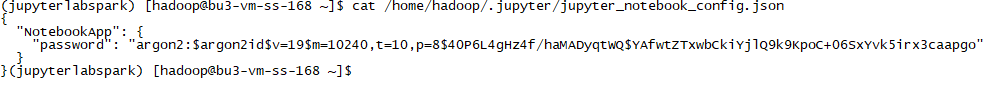
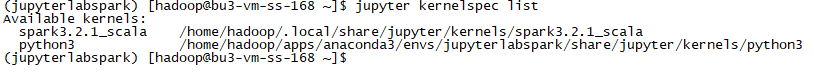

# 实验5 JupyterLab集成Spark运行环境搭建

## 前提条件

要想在JupyterLab环境下运行交互式Spark环境，需要满足以下几个前提条件。

* 安装好Spark。这里我们的版本是Spark 3.2.1，安装路径是/home/hadoop/apps/spark。

* 安装好Anaconda。这里我们的安装路径是/home/hadoop/apps/anaconda3。

* 配置好相关的环境变量。

  ```
  export JAVA_HOME=/home/hadoop/apps/java
  export HADOOP_HOME=/home/hadoop/apps/hadoop
  export HADOOP_CONF_DIR=/home/hadoop/apps/hadoop/etc/hadoop
  export YARN_CONF_DIR=/home/hadoop/apps/hadoop/etc/hadoop
  export SPARK_HOME=/home/hadoop/apps/spark
  export PYSPARK_PYTHON=/home/hadoop/apps/anaconda3/envs/pyspark/bin/python3
  export PATH=$JAVA_HOME/bin:$HADOOP_HOME/bin:$HADOOP_HOME/sbin:$SPARK_HOME/bin:$SPARK_HOME/sbin:$PATH
  ```

## 创新虚拟环境

在环境搭建之前，我们创建一个全新的隔离环境。

```
conda create -n jupyterlabspark python=3.9
```


输入选项`y`让过程继续完成。


环境创建创建完成后，根据提示进行虚拟环境的激活。

```
conda activate jupyterlabspark
```


## JupyterLab安装

### 安装

执行以下命令安装JupyterLab。

```
pip install jupyterlab -i https://pypi.tuna.tsinghua.edu.cn/simple
```


### 配置

安装完成后，为了保证可以通过网络访问JupyterLab，需要对它进行一些配置，执行以下命令，并修改配置文件`~/.jupyter/jupyter_lab_config.py`中关于限制IP地址的配置项`c.ServerApp.ip = '*'`，以便可以通过网络访问。

```
# jupyter notebook --generate-config
# jupyter notebook password
# /home/hadoop/.jupyter/

jupyter lab --generate-config

vi ~/.jupyter/jupyter_lab_config.py
```

修改的配置项如下。

```
c.ServerApp.ip = '*'
```

### 启动

配置完成以后，可以执行以下命令来启动JupyterLab。

```
jupyter lab
```


启动成功后，可以通过浏览器访问相关地址。

http://10.114.14.168:8888/lab?token=6dc3c703377e2ca797977ca075b1390991af42cd789775fd


以上方式打开的地址是带有token的，如果访问的地址是不带token的，http://10.114.14.168:8888/lab，则访问前会要求我们输入密码。


此时，我们并没有对JupyterLab设置密码，所以我们可以做的事情就是：要么通过带token的地址进行访问，要么给JupyterLab设置一个密码。

### 设置访问密码

下面我们给JupyterLab配置一个访问密码，执行以下命令。


按提示输入我们想要设置的密码，这里为了方便记忆，将密码设置为`jupyter`，确认密码并继续。

然后打开生成的密码文件`/home/hadoop/.jupyter/jupyter_notebook_config.json`，将里面的密码数据复制出来。

```
"argon2:$argon2id$v=19$m=10240,t=10,p=8$40P6L4gHz4f/haMADyqtWQ$YAfwtZTxwbCkiYjlQ9k9KpoC+06SxYvk5irx3caapgo"
```



修改配置文件`~/.jupyter/jupyter_lab_config.py`中关于密码的配置项`c.ServerApp.password`，并赋值为上述密码字符串。

```
vi ~/.jupyter/jupyter_lab_config.py
```

```
c.ServerApp.password = u'argon2:$argon2id$v=19$m=10240,t=10,p=8$40P6L4gHz4f/haMADyqtWQ$YAfwtZTxwbCkiYjlQ9k9KpoC+06SxYvk5irx3caapgo'
```

配置完成后，重启JupyterLab。

```
jupyter lab
```

此时，启动后将不会有带token的地址。


启动成功后访问地址http://10.114.14.168:8888/lab，录入密码的界面也变得比较简洁。


输入设置的密码`jupyter`，即可进行登录。


至此，JupyterLab安装成功。

## JupyterLab集成Python Spark

### 配置环境变量

可以创建一个独立的配置文件，`.bashlab`，内容为：

```
export PYSPARK_DRIVER_PYTHON=jupyter
export PYSPARK_DRIVER_PYTHON_OPTS='lab'
```

然后让配置文件生效：

```
source .bashlab
```

### 启动

配置好环境变量，并使之生效后，就可以启动PySpark了。

```
pyspark
```


启动成功后，可以访问相关地址，并编写PySpark代码。可以运行一段代码看看结果。

```
sc.parallelize([1,2,3,4,5]).map(lambda x: x + 1).collect()
```


## JupyterLab集成Scala Spark

为了能够使用Scala环境，我们需要安装一些必须的软件。

### 安装toree

```
pip install toree -i https://pypi.tuna.tsinghua.edu.cn/simple
```


### 安装jupyter-scala

安装jupyter-scala，顺便启动spark。

这里设置了几个选项：

* --master 指定Spark的master地址
* --spark_home 指定Spark的安装路径，里面包含HDFS、YARN等的相关配置

```
jupyter toree install --spark_opts='--master=local[*]' --user --kernel_name=spark3.2.1 --spark_home=/home/hadoop/apps/spark
```


安装完成后，可以看看当前JupyterLab拥有哪些kernel。

```
jupyter kernelspec list
```



### 启动

启动JupyterLab。

```
jupyter lab
```


然后访问相关地址，可以看到新增加的kernel。


新建一个notebook，并选择相应的kernel，编写代码并运行。可以运行一段代码看看结果。

```
sc.parallelize(List(1,2,3,4,5)).map(x => x * 2).collect()
```


当然，也可以运行复杂一点的代码。这里读取HDFS上的文件并进行数据展示。

```
val df = spark.read.parquet("/mnt/databrickscontainer1/restaurant-1-orders.parquet")

df.printSchema()
df.show()
```


