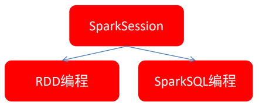

# SparkSQL概述

## 什么是SparkSQL

SparkSQL是Spark的一个模块，用于处理海量的结构化数据。

限定：**结构化数据处理**

## SparkSQL的特点

**集成的**：将Spark程序与SQL查询无缝整合。

SparkSQL允许使用SQL或DataFrame API在Spark程序中查询结构化数据。

**统一的数据访问**：以相同的方式连接到任何数据源。

DataFrames和SQL提供了一种访问各种数据源的常用方法，包括 Hive、Avro、Parquet、ORC、JSON 和 JDBC。

**Hive集成**：可以在现有的数仓上运行SQL或HiveQL查询。

Spark SQL支持HiveQL语法以及Hive SerDes和UDF，允许您访问现有的Hive仓库。

**标准连接**：支持通过JDBC或ODBC连接。

服务器模式为商业智能工具提供行业标准的 JDBC 和 ODBC 连接。

SparkSQL是非常成熟的海量结构化数据处理框架。

* SparkSQL本身十分优秀，支持SQL语言、性能强、可以自动优化、API简单、兼容Hive
* 企业大面积使用SparkSQL处理业务数据
  * 离线开发
  * 数仓搭建
  * 科学计算
  * 数据分析

## SparkSQL的发展历程

### HDFS -> Hive

由于Hadoop在企业生产中的大量使用，HDFS上积累了大量数据，为了给熟悉RDBMS但又不理解MapReduce的技术人员提供快速上手的工具，Hive应运而生。Hive的原理是将SQL语句翻译成MapReduce计算。

### Hive -> Shark

但是，MapReduce计算过程中大量的中间磁盘落地过程消耗了大量的I/O，降低了运行效率，为了提供SQL-on-Hadoop的效率，Shark出现了。

Shark框架是几乎100%模仿Hive，内部的配置项/优化项等都是直接模仿而来。不同的在于将执行引擎由MapReduce更换为了Spark。

Shark是伯克利AMPLab实验室Spark生态环境的组件之一，它修改了Hive中的内存管理、物理计划和执行三个模块，使得SQL语句直接运行在Spark上，从而使得SQL查询的速度得到10-100倍的提升。

### Shark之死

因为Shark框架太模仿Hive， Hive是针对MR优化，很多地方和SparkCore(RDD)水土不服。

随着Spark的发展，Shark对于Hive的太多依赖制约了Spark的One Stack rule them all的方针，制约了Spark各个组件的相互集成，同时Shark也无法利用Spark的特性进行深度优化，所以放弃了Shark，提出了SparkSQL项目。

### Shark -> SparkSQL

* 2014年 1.0 正式发布
* 2015年 1.3 发布DataFrame数据结构，沿用至今
* 2016年 1.6 发布Dataset数据结构(带泛型的DataFrame)，适用于支持泛型的语言(Java\Scala)
* 2016年 2.0 统一了Dataset 和 DataFrame，以后只有Dataset了，Python用的DataFrame就是没有泛型的Dataset
* 2019年 3.0 发布，性能大幅度提升，SparkSQL变化不大

##  SparkSQL和Hive的异同

<table>
    <tr>
        <td colspan="2" align="center">分布式SQL计算引擎</td>
    </tr>
    <tr align="center">
        <td>SparkSQL</td>
        <td>Hive</td>
    </tr>
    <tr>
        <td>内存计算</td>
        <td>磁盘迭代</td>
    </tr>
    <tr>
        <td>无元数据管理</td>
        <td>有元数据管理</td>
    </tr>
    <tr>
        <td>SQL/代码混合执行</td>
        <td>仅支持SQL开发</td>
    </tr>
    <tr>
        <td>底层运行Spark RDD</td>
        <td>底层运行MapReduce</td>
    </tr>
    <tr>
        <td colspan="2" align="center">都能运行在Yarn上</td>
    </tr>
</table>

* 都是分布式SQL计算引擎
* 都是构建大规模结构化数据计算的绝佳利器，SparkSQL拥有更好的性能

## SparkSQL的数据抽象

Pandas - DataFrame

* 二维表数据结构
* 单机（本地）集合

SparkCore - RDD

* 无标准数据结构，存储什么数据均可
* 分布式集合（分区） 

SparkSQL - DataFrame

* 二维表数据结构
* 分布式集合（分区）

SparkSQL有3类数据抽象对象

* SchemaRDD对象（已废弃）
* DataFrame对象：可用于Java、Scala、Python 、R
* Dataset对象：是有泛型的DataFrame，可用于Java、Scala这类支持泛型的语言

## DataFrame概述

DataFrame和RDD都是：**弹性的、分布式的、数据集**。

只是，DataFrame存储的数据结构“限定”为：**二维结构化数据**。

而RDD可以存储的数据则没有任何限制，想处理什么就处理什么。

这种二维的结构化数据更适合使用SQL进行处理。

## SparkSession对象

在RDD阶段，程序的执行入口对象是：SparkContext。

在Spark 2.0后，推出了SparkSession对象，作为Spark编码的统一入口对象。

SparkSession对象可以：

* 用于SparkSQL编程作为入口对象
* 用于SparkCore编程，可以通过SparkSession对象中获取到SparkContext

所以，我们后续的代码，执行环境入口对象，统一变更为SparkSession对象。