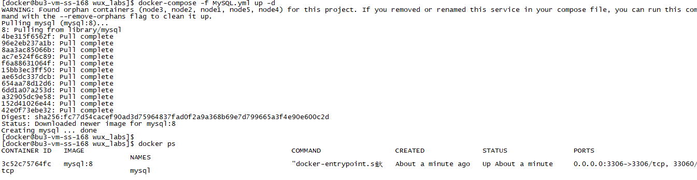
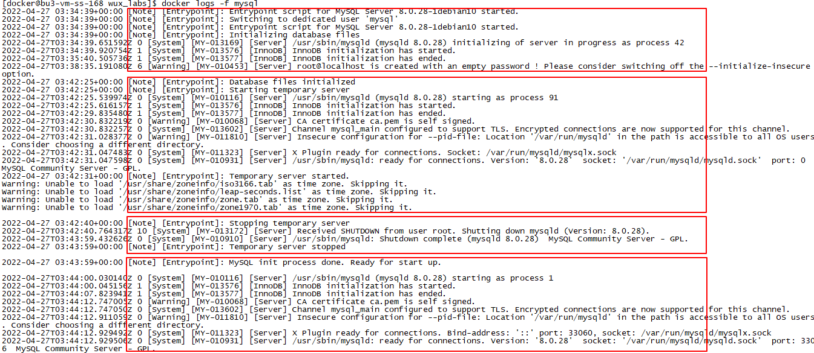

# 实验1 MySQL数据库安装

为了简化MySQL的安装，我们使用Docker进行，以下步骤使用docker用户进行操作。

## 任务1 MySQL数据库安装

### 步骤1 准备docker-compose文件

我们需要准备`MySQL.yml`文件。

```
version: '3.5'

services:
  mysql:
    image: mysql:8
    container_name: mysql
    restart: always
    environment:
      - "MYSQL_ROOT_PASSWORD=123456"
    ports:
      - 3306:3306
    networks:
      hadoop_networks_24:
        ipv4_address: 172.24.0.106

networks:
  hadoop_networks_24:
    driver: bridge
    ipam:
      config:
        - subnet: 172.24.0.0/24
```


### 步骤2 启动MySQL

当docker-compose文件准备好以后，就可以启动容器了。

```
docker-compose -f MySQL.yml up -d
docker ps
docker logs -f mysql
```



第一次启动MySQL过程会比较缓慢，因为容器内部需要大致完成以下几个阶段的工作：

* 数据库初始化
* Temporary server 启动
* Temporary server 停止
* MySQL 启动



## 任务2 MySQL数据库测试

### 步骤1 测试数据库的连接

配置数据源连接，并测试连接配置。


连接成功后可以看到当前数据库中的库信息。


### 步骤2 测试数据库的使用

#### 测试创建数据库

```sql
create database mysql_test;
```

数据库创建成功后，会在左侧树中显示出来。


#### 测试创建表

```sql
use mysql_test;
create table mysql_test_table(
    id int,
    name varchar(100)
);
```

成功创建表，左侧树结构中也会显示出来。


#### 测试数据操作

先来插入一条数据。

```sql
insert into mysql_test_table values (1,'wux_labs');
```

数据插入成功。


再来查询一下。

```sql
select * from mysql_test_table;
```

数据查询也成功。


到此，MySQL数据库安装完成。
