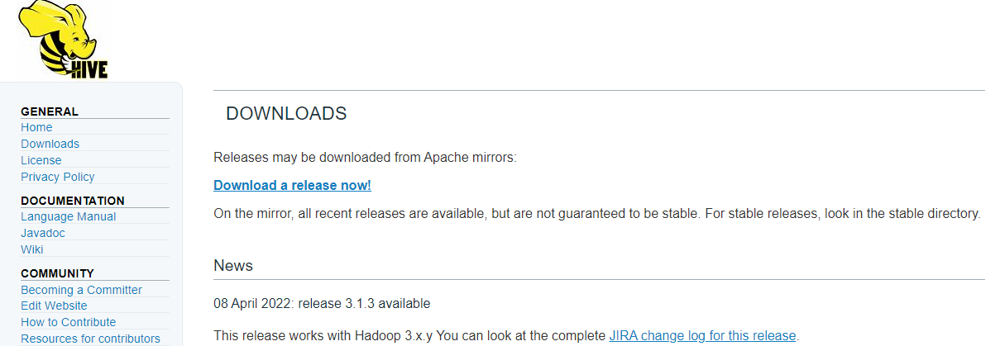
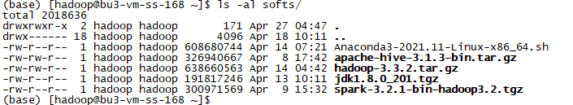
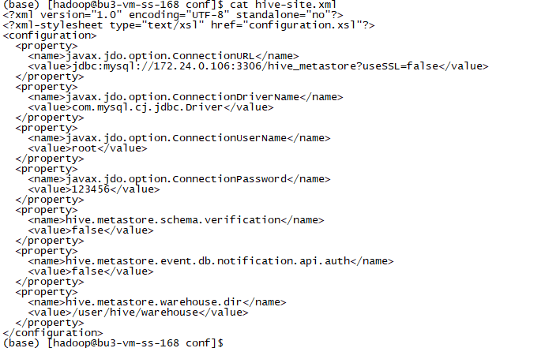

# 实验1 Hive安装

Hive的运行需要Hadoop环境，所以我们安装Hive就基于已有的Hadoop环境进行，同样用Docker进行运行。

本实验需要先完成 [实验1 MySQL数据库安装](实验1 MySQL数据库安装.md)。

由于Docker容器是采用挂载目录的方式，所以我们只需要在宿主机中安装并配置环境信息即可。

## 任务1 Hive安装

**以下步骤使用hadoop用户进行操作。**

### 步骤1 下载Hive安装包

从官网[https://hive.apache.org/downloads.html](https://hive.apache.org/downloads.html)下载Hive安装包。



或者也可以直接通过链接[https://dlcdn.apache.org/hive/hive-3.1.3/apache-hive-3.1.3-bin.tar.gz](https://dlcdn.apache.org/hive/hive-3.1.3/apache-hive-3.1.3-bin.tar.gz)进行下载。

国内镜像可使用[https://mirrors.tuna.tsinghua.edu.cn/apache/hive/hive-3.1.3/apache-hive-3.1.3-bin.tar.gz](https://mirrors.tuna.tsinghua.edu.cn/apache/hive/hive-3.1.3/apache-hive-3.1.3-bin.tar.gz)。

下载完成后，将安装包放到softs目录下。



### 步骤2 安装Hive

解压安装程序、创建软链接。

```
tar -xzf softs/hadoop-3.3.2.tar.gz -C apps/
cd apps
ln -s hadoop-3.3.2 hadoop
```


### 步骤3 配置Hive

Hive的配置中，最主要的是配置Hive的元数据相关的内容，这里我们使用MySQL作为Hive的元数据库。配置`hive-site.xml`文件，该文件本身不存在，直接新建一个即可。

```
cd /home/hadoop/apps/hive/conf
vi hive-site.xml
```

该配置主要是设置Hive的元数据存储在MySQL。

```
<?xml version="1.0" encoding="UTF-8" standalone="no"?>
<?xml-stylesheet type="text/xsl" href="configuration.xsl"?>
<configuration>
  <property>
    <name>javax.jdo.option.ConnectionURL</name>
    <value>jdbc:mysql://172.24.0.106:3306/hive_metastore?useSSL=false</value>
  </property>
  <property>
    <name>javax.jdo.option.ConnectionDriverName</name>
    <value>com.mysql.cj.jdbc.Driver</value>
  </property>
  <property>
    <name>javax.jdo.option.ConnectionUserName</name>
    <value>root</value>
  </property>
  <property>
    <name>javax.jdo.option.ConnectionPassword</name>
    <value>123456</value>
  </property>
  <property>
    <name>hive.metastore.schema.verification</name>
    <value>false</value>
  </property>
  <property>
    <name>hive.metastore.event.db.notification.api.auth</name>
    <value>false</value>
  </property>
  <property>
    <name>hive.metastore.warehouse.dir</name>
    <value>/user/hive/warehouse</value>
  </property>
</configuration>
```



由于我们使用了MySQL，所以需要将MySQL的驱动放到Hive的lib目录下。

驱动包可以自己下载，这里我们使用匹配数据库版本的`mysql-connector-java-8.0.28.jar`。


### 步骤4 创建元数据库

由于我们配置的元数据库使用的库名是`hive_metastore`，所以我们需要在MySQL中创建这个数据库。

```
create database hive_metastore;
```


### 步骤5 初始化元数据库

由于宿主机的环境与Docker容器内是一致的，并且初始化元数据库仅需要可以连MySQL即可，所以不需要在Docker容器内部执行，直接在宿主机执行即可。

在Hive的安装目录下执行以下语句以初始化元数据库。

```
bin/schematool -initSchema -dbType mysql -verbose
```

以上命令会连接到数据库、创建表、插入必要的数据。


初始化完成后，可以看到对应的表。


### 步骤6 验证Hive

执行命令启动Hive，并查看当前的数据库。

```
bin/hive
hive> show databases;
```

可以看到，当前Hive有一个数据库default。


在元数据库中的DBS表可以看到对应的数据。


创建一张表试试。

```sql
create table hive_table_test(id int, name string);
```


在元数据库的TBLS表中可以看到对应的数据。


此时，HDFS文件系统上会存在对应的目录。


#### Docker容器环境验证

**该步骤使用docker用户进行。**

在宿主机上使用Hive已经可以了，但我们并不会在宿主机使用，还是会在Docker容器内部进行使用。所以我们来验证一下容器内是否也可以。

先进入到容器中，看看apps下是否有安装好的Hive了。

```
docker exec -it -u hadoop node1 /bin/bash
cd ~/apps
ls -al
```

可以看到，由于是磁盘挂载，宿主机上磁盘文件变动会直接体现在容器内，容器内部的Hive自动安装好的。


我们启动Hive试试，再看看元数据是否正常。

```
cd hive/
bin/hive
hive> show tables;
```

可以看到，在Docker容器内部也可以正常使用Hive，正常连接元数据库。


由于Hive的数据操作会用到MapReduce，而MapReduce需要用到JobHistory，所以我们先启动相关服务。

```
cd $HADOOP_HOME
sbin/mr-jobhistory-daemon.sh start historyserver
jps
```


我们可以进行数据操作。

```sql
insert into hive_table_test values (1, 'wux_labs');
select * from hive_table_test;
```

可以看到，Hive先经过MapReduce，再将数据移动到对应的目录，最后将数据装载到表中。


此时，HDFS上就会存在对应的数据文件。


## 任务2 元数据服务启动

通过前面的任务，我们已经成功部署、配置、启动、验证了Hive。

现在我们来启动Hive的元数据服务。

### 步骤1 配置连接地址

要使用元数据服务，需要在`hive-site.xml`文件中增加如下配置。

```
  <property>
    <name>hive.metastore.uris</name>
    <value>thrift://node1:9083</value>
  </property>
```

最终的配置文件应该是这样的。

```
<?xml version="1.0" encoding="UTF-8" standalone="no"?>
<?xml-stylesheet type="text/xsl" href="configuration.xsl"?>
<configuration>
  <property>
    <name>javax.jdo.option.ConnectionURL</name>
    <value>jdbc:mysql://172.24.0.106:3306/hive_metastore?useSSL=false</value>
  </property>
  <property>
    <name>javax.jdo.option.ConnectionDriverName</name>
    <value>com.mysql.cj.jdbc.Driver</value>
  </property>
  <property>
    <name>javax.jdo.option.ConnectionUserName</name>
    <value>root</value>
  </property>
  <property>
    <name>javax.jdo.option.ConnectionPassword</name>
    <value>123456</value>
  </property>
  <property>
    <name>hive.metastore.schema.verification</name>
    <value>false</value>
  </property>
  <property>
    <name>hive.metastore.event.db.notification.api.auth</name>
    <value>false</value>
  </property>
  <property>
    <name>hive.metastore.warehouse.dir</name>
    <value>/user/hive/warehouse</value>
  </property>
  <property>
    <name>hive.metastore.uris</name>
    <value>thrift://node1:9083</value>
  </property>
</configuration>
```


### 步骤2 启动元数据服务

**配置完成元数据连接地址后**，直接通过Hive执行就会报错了，**必须启动元数据服务**才行。


我们通过Docker容器node1进行服务的启动。

```
nohup bin/hive --service metastore >> /dev/null 2>&1 &
```


再次执行Hive就可以成功了。

```sql
insert into hive_table_test values (2, 'wux_labs');
select * from hive_table_test;
```

插入并查询数据，成功。


此时，HDFS上会多出一个文件。


并且文件的内容就是我们插入的数据。


至此，Hive安装成功，元数据服务启动成功。
