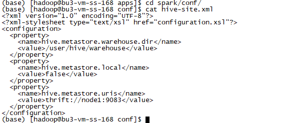
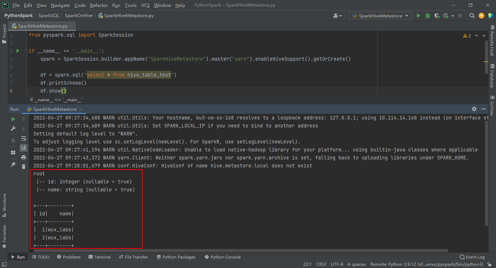

# 实验3 SparkSQL集成Hive的Metastore

本实验需要先完成 [实验2 Hive安装](实验2 Hive安装.md)。

根据Spark on Hive的原理，要让SparkSQL集成Hive的Metastore，只需要对Spark进行配置，让他知道如何连接Metastore即可。

前面我们已经启动了元数据服务，可以直接使用。

## 任务1 配置Spark集成Hive的Metastore

**以下步骤使用hadoop用户进行操作。**

### 步骤1 配置Spark

在Spark的conf目录中，创建hive-site.xml配置文件。

```
<?xml version="1.0" encoding="UTF-8"?>
<?xml-stylesheet type="text/xsl" href="configuration.xsl"?>
<configuration>
  <property>
    <name>hive.metastore.warehouse.dir</name>
    <value>/user/hive/warehouse</value>
  </property>
  <property>
    <name>hive.metastore.local</name>
    <value>false</value>
  </property>
  <property>
    <name>hive.metastore.uris</name>
    <value>thrift://node1:9083</value>
  </property>
</configuration>
```



### 步骤2 添加驱动包

SparkSQL使用了Hive的Metastore，由于Hive的Metastore存储在MySQL上，所以会涉及到连接MySQL数据库的情况，因此需要将MySQL的驱动包添加到Spark的jars目录中。

我们依然使用与MySQL版本匹配的驱动包`mysql-connector-java-8.0.28.jar`。


## 任务2 验证Spark on Hive

开发SparkSQL代码，并验证。因为Hive中已经有一张表`hive_table_test`了，所以我们就用这张表进行验证。

```python
from pyspark.sql import SparkSession

if __name__ == '__main__':
    spark = SparkSession.builder.appName("SparkHiveMetastore").master("yarn").enableHiveSupport().getOrCreate()
    
    df = spark.sql("select * from hive_table_test")
    df.printSchema()
    df.show()
```

可以看到，我们并没有像之前那样：

* spark.read.format().load()
* df.createOrReplaceTempView()

但我们依然成功读取到了HDFS上的Hive的表中的数据。



至此，SparkSQL集成Hive的Metastore就完成了。
