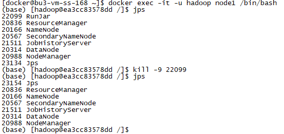
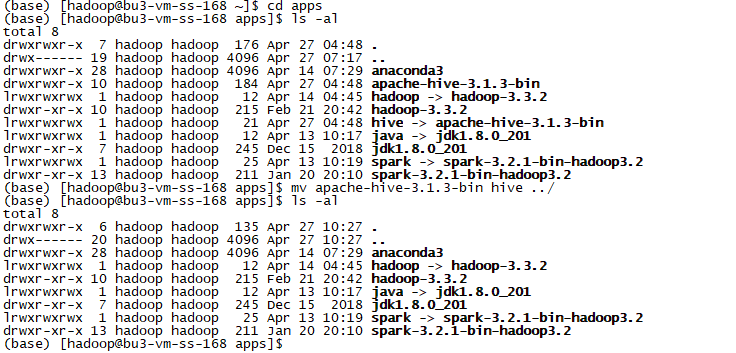
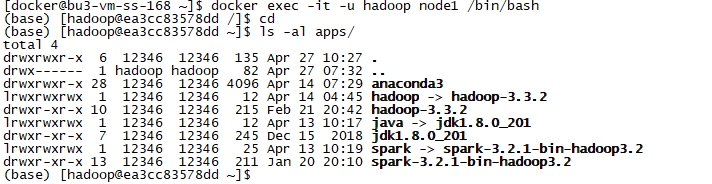
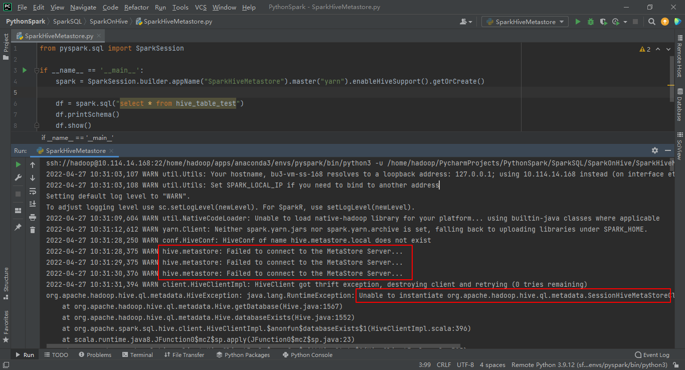
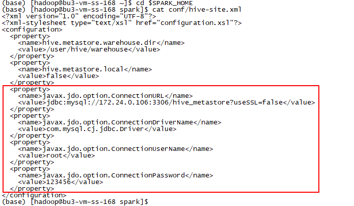
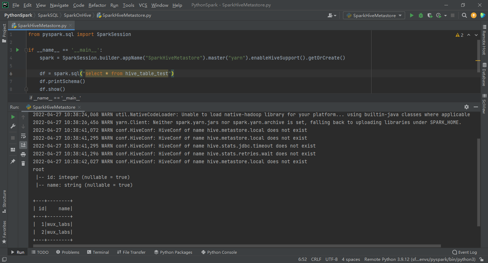
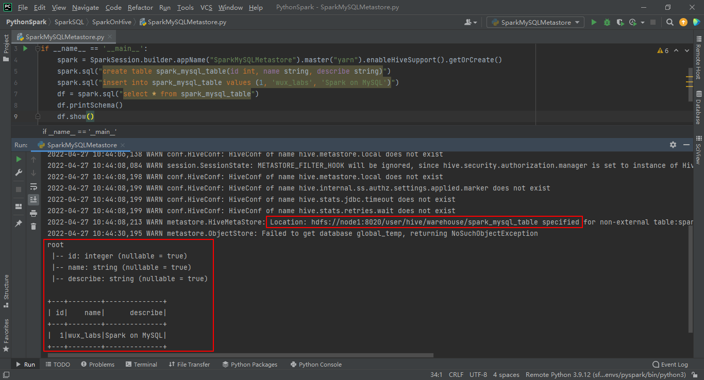
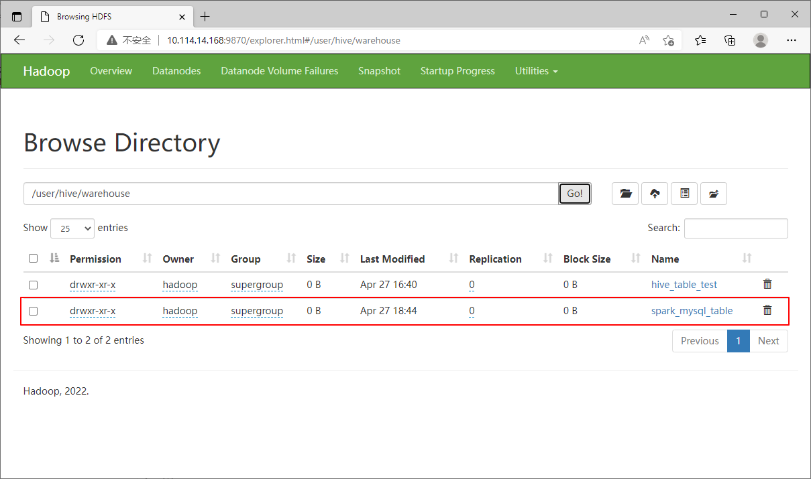
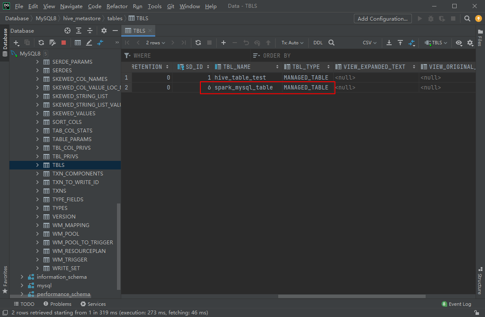

# 实验4 SparkSQL集成MySQL做Metastore

本实验需要先完成 [实验3 SparkSQL集成Hive的Metastore](实验3 SparkSQL集成Hive的Metastore.md)。

根据Spark on Hive的原理，要让SparkSQL集成Hive的Metastore，只需要对Spark进行配置，让他知道如何连接Metastore即可。

前面我们已经成功集成了Hive的Metastore。

但是，思考一下：

* Hive只是一个执行引擎，本身不存储元数据，而是将元数据存储在MySQL上
* Spark也是一个执行引擎，本身不存储元数据，需要与其他组件集成
* 我们已经将MySQL的驱动包放到了Spark的jars目录下

那么我们为什么不能干掉Hive，而直接使用SparkSQL集成MySQL做Metastore呢？

## 任务1 停止Hive的元数据服务并移除Hive的安装

### 步骤1 停止Hive的元数据服务

由于Hive的元数据服务是通过Docker的node1容器启动的，所以我们进入node1进行停止。

```
docker exec -it -u hadoop node1 /bin/bash
jps
kill -9 22099
```



### 步骤2 移除Hive的安装（选做）

实验过程中为了干净彻底，直接将Hive卸载。实际中Hive有其他用处，可以不用卸载。

在宿主机上使用hadoop用户将安装目录移走。

```
cd /home/hadoop/apps
mv apache-hive-3.1.3-bin hive ../
ls -al
```



然后确认一下Docker容器中的Hive也不存在了。



此时，再来执行SparkSQL代码。

```python
from pyspark.sql import SparkSession

if __name__ == '__main__':
    spark = SparkSession.builder.appName("SparkHiveMetastore").master("yarn").enableHiveSupport().getOrCreate()

    df = spark.sql("select * from hive_table_test")
    df.printSchema()
    df.show()
```

代码直接报错，无法连接Metastore。



## 任务2 配置SparkSQL集成MySQL做Metastore

### 步骤1 修改配置文件

同样还是修改Spark的conf目录下的hive-site.xml文件进行配置，只是现在将配置项直接指向MySQL。

```
<?xml version="1.0" encoding="UTF-8"?>
<?xml-stylesheet type="text/xsl" href="configuration.xsl"?>
<configuration>
  <property>
    <name>hive.metastore.warehouse.dir</name>
    <value>/user/hive/warehouse</value>
  </property>
  <property>
    <name>hive.metastore.local</name>
    <value>false</value>
  </property>
  <property>
    <name>javax.jdo.option.ConnectionURL</name>
    <value>jdbc:mysql://172.24.0.106:3306/hive_metastore?useSSL=false</value>
  </property>
  <property>
    <name>javax.jdo.option.ConnectionDriverName</name>
    <value>com.mysql.cj.jdbc.Driver</value>
  </property>
  <property>
    <name>javax.jdo.option.ConnectionUserName</name>
    <value>root</value>
  </property>
  <property>
    <name>javax.jdo.option.ConnectionPassword</name>
    <value>123456</value>
  </property>
</configuration>
```



### 步骤2 验证SparkSQL集成MySQL做Metastore

改完配置，我们再来验证一下代码。

```python
from pyspark.sql import SparkSession

if __name__ == '__main__':
    spark = SparkSession.builder.appName("SparkHiveMetastore").master("yarn").enableHiveSupport().getOrCreate()

    df = spark.sql("select * from hive_table_test")
    df.printSchema()
    df.show()
```

可以看到，执行成功了。



### 步骤3 验证SparkSQL集成MySQL做Metastore的其他操作

我们再来验证一下其他操作，比如创建表、插入数据等。

```python
from pyspark.sql import SparkSession

if __name__ == '__main__':
    spark = SparkSession.builder.appName("SparkMySQLMetastore").master("yarn").enableHiveSupport().getOrCreate()
    spark.sql("create table spark_mysql_table(id int, name string, describe string)")
    spark.sql("insert into spark_mysql_table values (1, 'wux_labs', 'Spark on MySQL')")
    df = spark.sql("select * from spark_mysql_table")
    df.printSchema()
    df.show()
```

可以看到，代码成功执行，并且基于Spark引擎，没有MapReduce过程。



此时，HDFS上会出现对应的目录。



元数据库中也会有对应的信息。



至此，SparkSQL集成MySQL做Metastore就成功了。

最后，为了保留Hive的安装信息，我们可以将Hive重新移动到原来的安装路径下。

```
cd ~
mv apache-hive-3.1.3-bin hive apps/
ls -al apps/
```


并且可以将MySQL的docker-compose文件与SparkOnYarn.yml进行整合，并且为了持久化数据，为MySQL指定数据卷映射，得到一个完整的docker-compose文件。

```
version: '3.5'

services:
  node1:
    image: wux_labs/spark:3.2.1
    container_name: node1
    restart: always
    volumes:
      - /home/hadoop/apps:/home/hadoop/apps
      - node1_works:/home/hadoop/works
    ports:
      - 8088:8088
      - 9870:9870
    networks:
      hadoop_networks_24:
        ipv4_address: 172.24.0.101

  node2:
    image: wux_labs/spark:3.2.1
    container_name: node2
    restart: always
    volumes:
      - /home/hadoop/apps:/home/hadoop/apps
      - node2_works:/home/hadoop/works
    networks:
      hadoop_networks_24:
        ipv4_address: 172.24.0.102

  node3:
    image: wux_labs/spark:3.2.1
    container_name: node3
    restart: always
    volumes:
      - /home/hadoop/apps:/home/hadoop/apps
      - node3_works:/home/hadoop/works
    networks:
      hadoop_networks_24:
        ipv4_address: 172.24.0.103

  node4:
    image: wux_labs/spark:3.2.1
    container_name: node4
    restart: always
    volumes:
      - /home/hadoop/apps:/home/hadoop/apps
      - node4_works:/home/hadoop/works
    networks:
      hadoop_networks_24:
        ipv4_address: 172.24.0.104

  node5:
    image: wux_labs/spark:3.2.1
    container_name: node5
    restart: always
    volumes:
      - /home/hadoop/apps:/home/hadoop/apps
      - node5_works:/home/hadoop/works
    networks:
      hadoop_networks_24:
        ipv4_address: 172.24.0.105

  mysql:
    image: mysql:8
    container_name: mysql
    restart: always
    volumes:
      - mysql_data:/var/lib/mysql
    environment:
      - "MYSQL_ROOT_PASSWORD=123456"
      - "TZ=Asia/Shanghai"
    ports:
      - 3306:3306
    networks:
      hadoop_networks_24:
        ipv4_address: 172.24.0.106

networks:
  hadoop_networks_24:
    driver: bridge
    ipam:
      config:
        - subnet: 172.24.0.0/24

volumes:
  node1_works:
    driver: local
  node2_works:
    driver: local
  node3_works:
    driver: local
  node4_works:
    driver: local
  node5_works:
    driver: local
  mysql_data:
    driver: local
```

