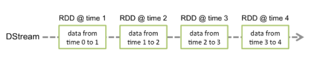
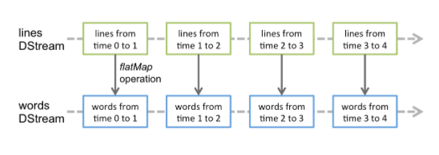

# 离散化流（DStream）介绍

**离散化流**或**DStream**是Spark Streaming提供的基本抽象。它表示连续的数据流，可以是从源接收的输入数据流，也可以是通过转换输入流生成的已处理数据流。在内部，DStream由一系列连续的RDD表示，DStream中的每个RDD都包含特定时间间隔的数据，如下图所示。

在DStream上应用的任何操作都将转换为对基础RDD的操作。在前面的例子中，flatMap操作应用于lines这个DStreams的每个RDD，生成words这个DStreams的RDD。

这些底层RDD转换由Spark引擎计算。DStream操作隐藏了大部分这些详细信息，并为开发人员提供了更高级别的API，以方便使用。

## 输入DStreams和Receivers

输入DStreams表示从数据源获取输入数据流的DStreams。在前面的例子中，`lines`表示输入DStream，它表示从指定的目录读取文件数据流。每个输入DStream都与Receiver对象相关联，该对象从源接收数据并将其存储在Spark的内存中以进行处理。

Spark流式处理提供两类内置流式处理源。

- 基本源：直接在流式处理上下文API中提供的源。示例：文件系统和套接字连接。
- 高级源：像Kafka，Kinesis等源可以通过额外的程序类获得，这些需要添加额外的依赖项。

如果要在流式处理应用程序中并行接收多个数据流，则可以创建多个输入DStream，这将创建多个Receiver，这些Receiver将同时接收多个数据流。但请注意，Spark工作线程/执行程序是一个长时间运行的任务，因此它占用分配给Spark流式处理应用程序的一个核心。因此，请务必记住，需要为Spark流式处理应用程序分配足够的核（如果本地运行，则为线程）来处理接收到的数据以及运行Receiver。

## 要记住的要点

- 在本地运行 Spark 流式处理程序时，请勿使用"local"或"local[1]"作为master。其中任何一个都意味着只有一个线程将用于在本地运行任务。如果使用的是基于Receiver的输入DStream，则单线程将用于运行Receiver，不留任何线程来处理接收的数据。因此，在本地运行时，请始终使用"local[n]"作为master，其中 n >要运行的Receiver数。
- 将逻辑扩展到在群集上运行时，分配给Spark流式处理应用程序的核心数必须大于Receiver数。否则，系统将接收数据，但无法处理数据。
