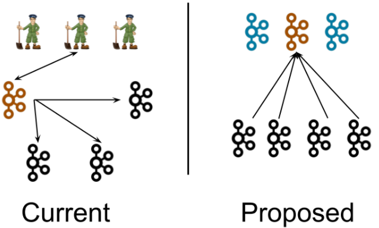
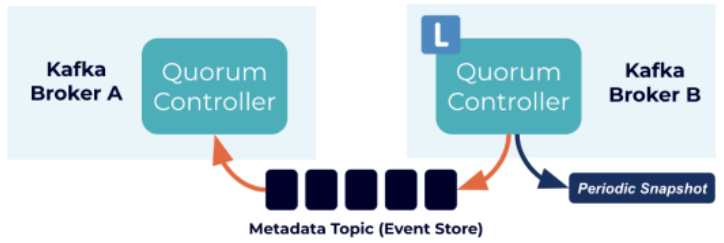

# Kafka 3.1.0集群（KRaft模式）

## KRaft简介

Kafka的共识机制KRaft，仍然处于预览机制。未来KRaft将作为Apache Kafka的内置共识机制将取代Zookeeper。该模式在2.8版本当中就已经发布了体验版本，在3.x系列中KRaft是一个稳定release版本。 KRaft运行模式的Kafka集群，不会将元数据存储在Zookeeper中，也就是无需部署Zookeeper集群，因为Kafka将元数据存储在Controller节点的KRaft Quorum中。KRaft可以带来很多好处，比如可以支持更多的分区，更快速的切换Controller，也可以避免Controller缓存的元数据和Zookeeper存储的数据不一致带来的一系列问题。

## KRaft架构

首先来看一下KRaft在系统架构层面和之前的版本有什么区别。

在当前架构中，一个Kafka集群包含多个Broker节点和一个ZooKeeper集群。这张图中描绘了一个典型的集群结构：4个Broker节点和3个Zookeeper节点，Kafka集群的Controller（橙色)在被选中后，会从Zookeeper中加载他的状态。Controller指向其他Broker节点的箭头表示Controller在通知其他Broker发生了变更。

在新的架构中，3个Controller节点代替三个Zookeeper节点。Controller节点和Broker节点在不同的进程中。Controller节点中会选择一个成为Leader（橙色）。新架构中，Controller不会向Broker推送更新，而是Broker从这个Controller Leader拉取元数据的更新信息。

尽管Controller进程在逻辑上与Broker进程是分离的，但他们不需要在物理上分离，即在某些情况下，部分所有Controller进程和Broker进程可以使同一个进程，即一个Broker节点既是Broker也是Controller。另外在同一个节点上可以运行两个进程，一个是Controller进程，一个是Broker进程。

## Controller

在KRaft模式下，只有一小部分特别指定的节点可以作为Controller，在server.properties的process.roles 参数里面配置。不像基于Zookeeper的模式，任何节点都可以成为Controller。这带来了一个非常优秀的好处，即如果我们认为Controller节点的负载会比其他只当做Broker节点高，那么配置为Controller节点就可以使用高配的机器。这就解决了在1.0、2.0架构中，Controller节点会比其他节点负载高，却无法控制哪些节点能成为Controller节点的问题。

被选中的Controller节点将参与元数据集群的选举。每个Controller节点要么是Active的，要么是StandBy的。

通常会选择3或5（奇数）个节点成为Controller节点，奇数个节点是为了在选举的时候少数服从多数。这取决于成本和系统在不影响可用性的情况下应该承受的并发故障数量等因素。

## Process.Roles

每个Kafka节点现在都有一个新的配置项，叫做Process.Roles，这个参数可以有以下值：

* 如果process.roles = broker, 节点在KRaft模式中充当 Broker。
* 如果process.roles = controller, 节点在KRaft模式下充当 Controller。
* 如果process.roles = broker,controller，节点在KRaft模式中同时充当Broker和Controller，称为“组合”节点。
* 如果process.roles 没有设置。那么集群就假定是运行在Zookeeper模式下。

目前不能在不重新格式化目录的情况下在Zookeeper模式和KRaft模式之间来回转换。

对于简单的场景，组合节点更容易运行和部署，可以避免多进程运行时，JVM带来的相关的固定内存开销。关键的缺点是，Controller将较少地与系统的其余部分隔离。

## Quorum Voters

系统中的所有节点都必须设置 `controller.quorum.voters` 配置。这个配置标识有哪些节点是Quorum的投票者节点。所有想成为Controller的节点都需要包含在这个配置里面。这类似于在使用Zookeeper时，使用zookeeper.connect配置时必须包含所有的Zookeeper节点。 

然而，与Zookeeper配置不同的是，`controller.quorum.voters` 配置需要包含每个节点的id。格式为: id1@host1:port1,id2@host2:port2。

## 运行KRaft集群

运行KRaft集群，主要分为三步：

- 用kafka-storage.sh生成一个唯一的集群ID
- 用kafka-storage.sh格式化存储数据的目录
- 用kafka-server-start.sh启动Kafka Server
