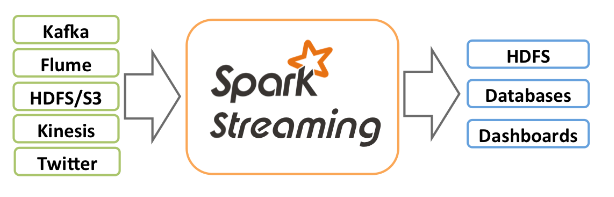
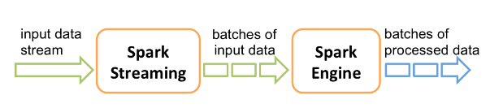

# SparkStreaming 概述

参考资料：[Spark Streaming - Spark 3.2.1 Documentation](https://spark.apache.org/docs/3.2.1/streaming-programming-guide.html)

Spark Streaming是Spark核心API的扩展，支持实时数据流的可扩展、高吞吐量、容错流处理。数据可以从许多来源（如Kafka、Kinesis或TCP套接字）提取，并且可以使用用高级函数（如`map`、`reduce`、`join`和`window`）表示的复杂算法进行处理。最后，处理后的数据可以推送到文件系统、数据库和实时仪表板。实际上，还可以将Spark的 [机器学习](https://spark.apache.org/docs/3.2.1/ml-guide.html)和 [图形处理](https://spark.apache.org/docs/3.2.1/graphx-programming-guide.html)算法应用于数据流。



在内部，它的工作原理如下。Spark Streaming接收实时输入数据流并将数据分成批次，然后由Spark引擎处理以批量生成最终的结果流。



Spark Streaming提供了一种称为**离散流**或**DStream**的高级抽象，它表示连续的数据流。DStream可以从来自Kafka和Kinesis等源的输入数据流创建，也可以通过对其他DStream应用高级操作来创建。在内部，一个DStream表示为一个[RDD](https://spark.apache.org/docs/3.2.1/api/scala/org/apache/spark/rdd/RDD.html)序列 。

## 基本概念

### 导入依赖

如果是使用Scala、Java编写Spark Streaming程序，必须将以下依赖项引入项目中。

```
<dependency>
    <groupId>org.apache.spark</groupId>
    <artifactId>spark-streaming_2.12</artifactId>
    <version>3.2.1</version>
</dependency>
```

如果是使用Python编写Spark Streaming程序，pyspark包中已经包含了相关的内容。

### 初始化 StreamingContext

要初始化Spark Streaming程序，必须创建一个**StreamingContext**对象，它是所有Spark Streaming功能的**主要入口点**。

可以从SparkContext对象创建StreamingContext对象。

```python
from pyspark import SparkContext
from pyspark.streaming import StreamingContext

sc = SparkContext(master, appName)
ssc = StreamingContext(sc, 1)
```

必须根据应用程序的延迟要求和可用集群资源设置批处理间隔。

### 必须执行的操作

定义上下文后，必须执行以下操作。

1. 通过创建输入DStream来定义输入源。
2. 通过对DStream应用转换和输出操作来定义流计算。
3. 开始接收数据并使用`ssc.start()`。
4. 使用等待处理停止（手动或由于任何错误）`ssc.awaitTermination()`。
5. 可以使用 手动停止处理`ssc.stop()`。

### 要记住的要点

- 一旦启动了上下文，就不能设置或添加新的流计算。
- 一旦上下文停止，就无法重新启动。
- 一个JVM中只能同时激活一个StreamingContext。
- StreamingContext上的stop()也会停止SparkContext。要仅停止StreamingContext，请将`stop()`调用的可选参数设置`stopSparkContext`为 false。
- 一个SparkContext可以重复用于创建多个StreamingContext，只要在创建下一个StreamingContext之前停止前一个 StreamingContext（不停止 SparkContext）。
