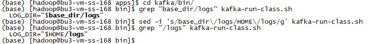

# 实验1 Kafka安装

为了简化Kafka的安装，我们使用Docker进行。

## 任务1 Kafka安装

**以下步骤使用hadoop用户进行操作。**

### 步骤1 下载Kafka安装包

从官网[Apache Kafka](https://kafka.apache.org/downloads)下载Hive安装包。


或者也可以直接通过链接[https://dlcdn.apache.org/kafka/3.1.0/kafka_2.12-3.1.0.tgz](https://dlcdn.apache.org/kafka/3.1.0/kafka_2.12-3.1.0.tgz)进行下载。

国内镜像可以使用[https://mirrors.tuna.tsinghua.edu.cn/apache/kafka/3.1.0/kafka_2.12-3.1.0.tgz](https://mirrors.tuna.tsinghua.edu.cn/apache/kafka/3.1.0/kafka_2.12-3.1.0.tgz)。

下载完成后，将安装包放到softs目录下。


### 步骤2 安装Kafka

解压安装程序、创建软链接。

```
tar -xzf softs/kafka_2.12-3.1.0.tgz -C apps/
cd apps/
ln -s kafka_2.12-3.1.0 kafka
ls -al
```


### 步骤3 修改脚本

默认Kafka运行的时候都会通过log4j打印很多日志文件，比如server.log、controller.log、state-change.log等，而都会将其输出到$KAFKA_HOME/logs目录下，由于我们采用的是Docker容器磁盘挂载的方式，所以不可能将所有节点的日志都输出到$KAFKA_HOME/logs目录下。

我们可以通过修改`kafka-run-class.sh`，让日志输出到`$HOME/logs`目录下。

```
cd kafka/bin/
grep "/logs" kafka-run-class.sh
sed -i 's/base_dir\/logs/HOME\/logs/g' kafka-run-class.sh 
grep "/logs" kafka-run-class.sh
```



## 任务2 Docker镜像制作

**以下步骤使用docker用户进行操作**

### 步骤1 制作 Dockerfile 文件

环境说明：

* 延用Hadoop安装的时候的Dockerfile文件，仅在需要调整的地方做相应的调整

* 使用centos作为底层系统
* 保留免密登录、ssh服务
* 保留相同的用户、挂载点
* 容器内的部署用户使用 `hadoop` 用户，并配置节点间的免密登录。
* 为用户配置好相关的环境变量
* 创建挂载点 `~/apps` 用于挂载安装程序，创建预留挂载点 `~/logs` 用于存放日志文件、`~/works` 用于程序运行的工作目录、`~/softs` 用于存放一些需要提交到容器内部进行安装、运行的程序。

创建Dockerfile文件`Kafka`：

```
FROM centos:centos7.6.1810

MAINTAINER wux_labs wux_labs@outlook.com

# 安装sshd服务
RUN mkdir /var/run/sshd

RUN yum -y install net-tools openssl openssh-server openssh-clients which sudo

RUN sed -i 's/#PermitRootLogin yes/PermitRootLogin yes/g' /etc/ssh/sshd_config
RUN sed -i 's/#RSAAuthentication yes/RSAAuthentication yes/g' /etc/ssh/sshd_config
RUN sed -i 's/#PubkeyAuthentication yes/PubkeyAuthentication yes/g' /etc/ssh/sshd_config

RUN ssh-keygen -t dsa -f /etc/ssh/ssh_host_dsa_key
RUN ssh-keygen -t rsa -f /etc/ssh/ssh_host_rsa_key
RUN ssh-keygen -t ecdsa -b 256 -f /etc/ssh/ssh_host_ecdsa_key
RUN ssh-keygen -t ed25519 -b 256 -f /etc/ssh/ssh_host_ed25519_key

RUN echo "root   ALL=(ALL)     ALL" >> /etc/sudoers

# 创建用户和组
RUN groupadd hadoop
RUN useradd -g hadoop hadoop

USER hadoop

# 为hadoop用户设置节点间的免密登录
RUN ssh-keygen -t rsa -f ~/.ssh/id_rsa
RUN cp ~/.ssh/id_rsa.pub ~/.ssh/authorized_keys

# 配置环境变量
RUN echo $'export JAVA_HOME=/home/hadoop/apps/java\n\
export KAFKA_HOME=/home/hadoop/apps/kafka\n\
export PATH=$JAVA_HOME/bin:$KAFKA_HOME/bin:$PATH\n\
' >> ~/.bashrc

RUN mkdir -p ~/apps ~/logs ~/softs ~/works
VOLUME ["/home/hadoop/apps","/home/hadoop/logs","/home/hadoop/softs","/home/hadoop/works"]

USER root

# 容器一运行就启动sshd服务
CMD ["/usr/sbin/sshd","-D"]
```


### 步骤2 构建 Docker 镜像

执行以下命令，通过Dockerfile构建镜像：

```
docker build --no-cache -f Kafka -t wux_labs/kafka:3.1.0 .

docker images | grep wux_labs
```


## 任务3 启动Kafka

**以下步骤使用docker用户进行操作**

### 步骤1 配置Kafka的配置文件

Kafka的配置文件最主要的是config目录下的**server.properties**文件。

其中有几个重要的配置项：

* node.id：集群中节点的编号，每个节点需要唯一
* process.roles：集群中节点的角色列表，如果不配置这个，则需要配置Zookeeper
* controller.quorum.voters：标识有哪些节点是Quorum的投票者节点，所有想成为Controller的节点都需要包含在这个配置里面
* inter.broker.listener.name：指定Broker监听地址的协议
* controller.listener.names：指定Controller监听地址的协议
* listeners：当前节点的监听端口配置
* advertised.listeners：供客户端使用的地址
* log.dirs：Kafka的日志路径，也就是数据存放的路径

我们计划部署3个节点的集群，所以配置3个**server.properties**文件。

`kafka-node1-server.properties`文件：

```
process.roles=broker,controller
node.id=1
controller.quorum.voters=1@172.24.0.107:9093,2@172.24.0.108:9093,3@172.24.0.109:9093
inter.broker.listener.name=PLAINTEXT
controller.listener.names=CONTROLLER
listeners=PLAINTEXT://172.24.0.107:9092,CONTROLLER://172.24.0.107:9093
advertised.listeners=PLAINTEXT://172.24.0.107:9092
log.dirs=/home/hadoop/works/kafka/kraft-combined-logs
```

`kafka-node2-server.properties`文件：

```
process.roles=broker,controller
node.id=2
controller.quorum.voters=1@172.24.0.107:9093,2@172.24.0.108:9093,3@172.24.0.109:9093
inter.broker.listener.name=PLAINTEXT
controller.listener.names=CONTROLLER
listeners=PLAINTEXT://172.24.0.108:9092,CONTROLLER://172.24.0.108:9093
advertised.listeners=PLAINTEXT://172.24.0.108:9092
log.dirs=/home/hadoop/works/kafka/kraft-combined-logs
```

`kafka-node3-server.properties`文件：

```
process.roles=broker,controller
node.id=3
controller.quorum.voters=1@172.24.0.107:9093,2@172.24.0.108:9093,3@172.24.0.109:9093
inter.broker.listener.name=PLAINTEXT
controller.listener.names=CONTROLLER
listeners=PLAINTEXT://172.24.0.109:9092,CONTROLLER://172.24.0.109:9093
advertised.listeners=PLAINTEXT://172.24.0.109:9092
log.dirs=/home/hadoop/works/kafka/kraft-combined-logs
```


### 步骤2 创建docker-compose文件

我们通过 docker-compose 来管理容器，所以先创建一个 docker-compose 文件`Kafka.yml`。在配置中，我们需要将安装软件目录挂载到容器、将配置文件也挂载到容器内、挂载数据卷以持久化数据。

```
version: '3.5'

services:
  kafka-node1:
    image: wux_labs/kafka:3.1.0
    container_name: kafka-node1
    restart: always
    volumes:
      - /home/hadoop/apps:/home/hadoop/apps
      - ./kafka-node1-server.properties:/home/hadoop/apps/kafka/config/server.properties
      - kafka_node1_works:/home/hadoop/works
    networks:
      hadoop_networks_24:
        ipv4_address: 172.24.0.107

  kafka-node2:
    image: wux_labs/kafka:3.1.0
    container_name: kafka-node2
    restart: always
    volumes:
      - /home/hadoop/apps:/home/hadoop/apps
      - ./kafka-node2-server.properties:/home/hadoop/apps/kafka/config/server.properties
      - kafka_node2_works:/home/hadoop/works
    networks:
      hadoop_networks_24:
        ipv4_address: 172.24.0.108

  kafka-node3:
    image: wux_labs/kafka:3.1.0
    container_name: kafka-node3
    restart: always
    volumes:
      - /home/hadoop/apps:/home/hadoop/apps
      - ./kafka-node3-server.properties:/home/hadoop/apps/kafka/config/server.properties
      - kafka_node3_works:/home/hadoop/works
    networks:
      hadoop_networks_24:
        ipv4_address: 172.24.0.109

networks:
  hadoop_networks_24:
    driver: bridge
    ipam:
      config:
        - subnet: 172.26.0.0/24

volumes:
  kafka_node1_works:
    driver: local
  kafka_node2_works:
    driver: local
  kafka_node3_works:
    driver: local
```


### 步骤3 启动容器

```
docker-compose -f Kafka.yml up -d

docker ps
```


启动成功后，可以进入容器内部，验证一下环境配置是否正常。

```
docker exec -it -u hadoop kafka-node1 /bin/bash

cd ~
java -vesion
ls -al apps/
cat apps/kafka/config/server.properties
```


### 步骤4 为Kafka集群生成唯一集群ID

运行KRaft模式的Kafka集群的第一步，是需要**用kafka-storage.sh 生成一个唯一的集群ID**。由于Kafka的安装路径下的bin已经被我们添加到了环境变量$PATH中，所以可以直接执行下面的命令。

```
kafka-storage.sh random-uuid
```


### 步骤5 为Kafka集群格式化数据目录

运行KRaft模式的Kafka集群的第二步，是需要**在每一个节点上，用kafka-storage.sh 格式化存储数据的目录**。这里需要使用前面步骤生成的集群ID。

```
kafka-storage.sh format -t xQFvb6gqT7CNm4dN5sMcWQ -c $KAFKA_HOME/config/server.properties

ssh kafka-node2 kafka-storage.sh format -t xQFvb6gqT7CNm4dN5sMcWQ -c $KAFKA_HOME/config/server.properties

ssh kafka-node3 kafka-storage.sh format -t xQFvb6gqT7CNm4dN5sMcWQ -c $KAFKA_HOME/config/server.properties

ls -al works/kafka/kraft-combined-logs/

cat works/kafka/kraft-combined-logs/meta.properties

ssh kafka-node2 cat works/kafka/kraft-combined-logs/meta.properties

ssh kafka-node3 cat works/kafka/kraft-combined-logs/meta.properties
```


### 步骤5 启动Kafka集群

运行KRaft模式的Kafka集群的第三步，是需要**在每一个节点上，用bin/kafka-server-start.sh 启动Kafka Server**。

```
nohup kafka-server-start.sh $KAFKA_HOME/config/server.properties > ~/logs/kafka-server-start.log 2>&1 &

ssh kafka-node2 nohup kafka-server-start.sh $KAFKA_HOME/config/server.properties > ~/logs/kafka-server-start.log 2>&1 &

ssh kafka-node3 nohup kafka-server-start.sh $KAFKA_HOME/config/server.properties > ~/logs/kafka-server-start.log 2>&1 &

ssh kafka-node1 "jps && netstat -ntlp"
ssh kafka-node2 "jps && netstat -ntlp"
ssh kafka-node3 "jps && netstat -ntlp"
```

启动完成后，在每个节点上都应该有Kafka进程。


## 任务4 验证Kafka集群

**以下步骤使用hadoop用户进行操作**

Kafka集群启动完成后，我们可以将宿主机作为Kafka客户端来进行验证，由于Kafka相关的软件在hadoop用户下，所以切换到hadoop用户进行操作。

### 步骤1 验证Topic的创建及查看

```
cd /home/hadoop/apps/kafka

bin/kafka-topics.sh --create --topic KafkaRaftTest --partitions 1 --replication-factor 1 --bootstrap-server 172.24.0.107:9092,172.24.0.108:9092,172.24.0.109:9092

bin/kafka-topics.sh --list --bootstrap-server 172.24.0.107:9092,172.24.0.108:9092,172.24.0.109:9092
```


### 步骤2 验证发送消息到Topic

```
bin/kafka-console-producer.sh --bootstrap-server 172.24.0.107:9092,172.24.0.108:9092,172.24.0.109:9092 --topic KafkaRaftTest
```


### 步骤3 验证从Topic消费消息

```
bin/kafka-console-consumer.sh --bootstrap-server 172.24.0.107:9092,172.24.0.108:9092,172.24.0.109:9092 --topic KafkaRaftTest
```


至此，Kafka集群搭建完成。
