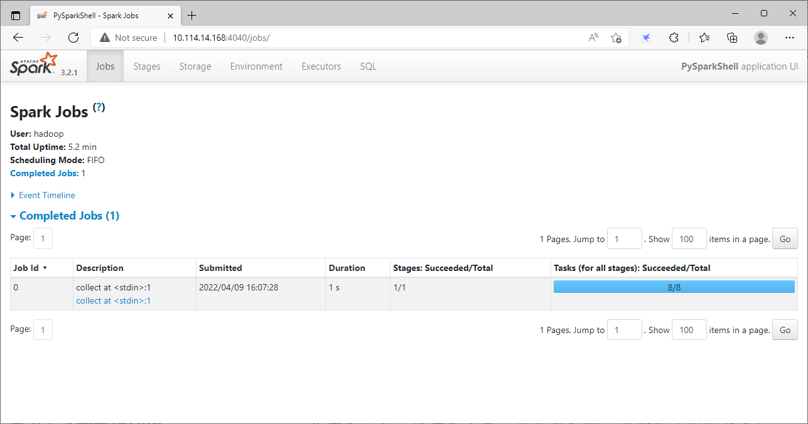

# Spark 环境搭建

## Spark 安装程序下载

首先通过Spark的官方网站https://spark.apache.org/downloads.html下载Spark的安装程序。


或者直接通过下载链接https://www.apache.org/dyn/closer.lua/spark/spark-3.2.1/spark-3.2.1-bin-hadoop3.2.tgz进行下载。

将下载好的安装程序放置到softs目录下。


## Local 模式安装

### 基本原理

本质：**启动一个JVM Process进程(一个进程里面有多个线程)，执行任务Task**。

* Local模式可以限制模拟Spark集群环境的线程数量，即Local[N] 或 Local[\*]。
* 其中N代表可以使用N个线程，每个线程拥有一个CPU Core。如果不指定N，则默认是1个线程（该线程有1个core）。 通常CPU有几个Core，就指定几个线程，最大化利用计算能力。
* 如果是local[*]，则代表 Run Spark locally with as many worker threads as logical cores on your machine。按照CPU最多的Cores设置线程数。

Local 下的角色分布：

资源管理：

* Master：Local进程本身
* Worker：Local进程本身

任务执行：

* Driver：Local进程本身
* Executor：不存在，没有独立的Executor角色，而是由Local进程(也就是Driver)内的线程提供计算能力

> Driver也算一种特殊的Executor，只不过多数时候，我们将Executor当做纯Worker对待，这样和Driver好区分
> 注意：Local模式只能运行一个Spark程序，如果执行多个Spark程序，那就是由多个相互独立的Local进程在执行

### 环境搭建

开箱即用：**解压安装包之后，直接运行bin目录下的相关命令即可**。

创建apps目录，并将Spark安装包解压到apps目录下。

```
mkdir -p apps
tar -xzf softs/spark-3.2.1-bin-hadoop3.2.tgz -C apps/
ls -al apps/
```


切换到Spark的安装路径下。

```
cd ~/apps/spark-3.2.1-bin-hadoop3.2
ls -al
```


### 环境验证

#### 测试spark-shell

spark-shell 程序，可以提供一个交互式的 Scala 解释器环境，在这里面可以用 Scala 语言调用 Spark API 进行计算。

```
bin/spark-shell
```


* Spark Web UI：http://10.114.14.168:4040
* Spark 版本：version 3.2.1
* Scala 版本：Scala version 2.12.15
* sc：SparkContext实例对象
* spark：SparkSession实例对象
* 4040：Web监控页面端口号

```
scala> sc.parallelize(List(1,2,3,4,5)).map(x => x * 2).collect()
```


#### 测试pyspark

pyspark程序，可以提供一个交互式的 Python 解释器环境，在这里面可以用 Python 语言调用 Spark API 进行计算。

```
bin/pyspark
```


* Spark Web UI：http://10.114.14.168:4040
* Spark 版本：version 3.2.1
* Python 版本：Python version 3.6.8
* sc：SparkContext实例对象
* spark：SparkSession实例对象
* 4040：Web监控页面端口号

```
>>> sc.parallelize([1,2,3,4,5]).map(lambda x: x + 1).collect()
```


#### 测试Spark Web UI

访问http://10.114.14.168:4040。



通过上面的界面，我们可以看到提交的job。


在Executors页面，我们可以发现仅有一个Driver程序。因为我们是Local模式，Driver即管理又干活。

同时，输入jps可以看到local模式下的唯一进程存在，这个进程既是master也是worker。


#### 测试spark-submit

spark-submit程序，作用：提交指定的Spark代码到Spark环境中运行。

语法：

```
bin/spark-submit [可选的一些选项] jar包或者Python代码的路径 [代码的参数]
```

示例：

```
bin/spark-submit --class org.apache.spark.examples.SparkPi examples/jars/spark-examples_2.12-3.2.1.jar 10
```

```
bin/spark-submit examples/src/main/python/pi.py 10
```

#### spark-shell/pyspark/spark-submit 对比

| 程序     | spark-shell                                                  | pyspark                                                      | spark-submit                               |
| -------- | ------------------------------------------------------------ | ------------------------------------------------------------ | ------------------------------------------ |
| 功能     | 提供一个交互式的 Scala 解释器环境，在这里面可以用 Scala 语言调用 Spark API 进行计算。 | 提供一个交互式的 Python 解释器环境，在这里面可以用 Python 语言调用 Spark API 进行计算。 | 提交指定的Spark代码到Spark环境中运行。     |
| 特点     | 交互式环境，写一行执行一行                                   | 交互式环境，写一行执行一行                                   | 提交代码用                                 |
| 使用场景 | 学习/测试/交互式验证等                                       | 学习/测试/交互式验证等                                       | 生产场景/正式场合，正式提交Spark程序运行。 |

