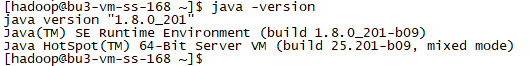
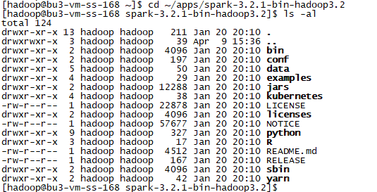
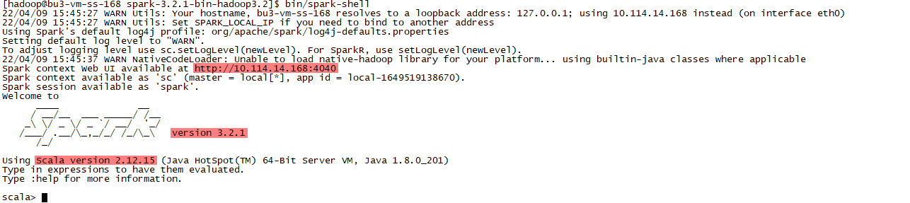
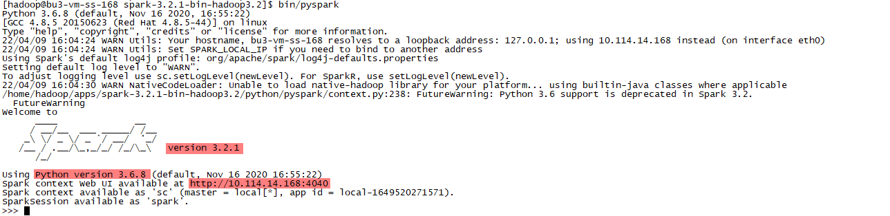

# 实验1 Spark Local模式搭建

本实验主要是在单机环境上安装Spark，并以Local模式运行Spark。

为了方便后续使用，我们的环境通过hadoop用户进行安装。所以，在安装Spark之前，请确保本机环境创建了hadoop用户，并且配置了Java 8+。



## 任务1 Spark安装程序下载

首先通过Spark的官方网站[https://spark.apache.org/downloads.html](https://spark.apache.org/downloads.html)下载Spark的安装程序。


或者直接通过下载链接[https://www.apache.org/dyn/closer.lua/spark/spark-3.2.1/spark-3.2.1-bin-hadoop3.2.tgz](https://www.apache.org/dyn/closer.lua/spark/spark-3.2.1/spark-3.2.1-bin-hadoop3.2.tgz)进行下载。

将下载好的安装程序放置到softs目录下。


## 任务2 安装Spark程序

创建apps目录，并将Spark安装包解压到apps目录下。

```
mkdir -p apps
tar -xzf softs/spark-3.2.1-bin-hadoop3.2.tgz -C apps/
ls -al apps/
```


切换到Spark的安装路径下。

```
cd ~/apps/spark-3.2.1-bin-hadoop3.2
ls -al
```



## 任务3 测试Spark Local模式

#### 步骤1 测试spark-shell

spark-shell 程序，可以提供一个交互式的 Scala 解释器环境，在这里面可以用 Scala 语言调用 Spark API 进行计算。

```
bin/spark-shell
```



* Spark Web UI：http://10.114.14.168:4040
* Spark 版本：version 3.2.1
* Scala 版本：Scala version 2.12.15
* sc：SparkContext实例对象
* spark：SparkSession实例对象
* 4040：Web监控页面端口号

```
scala> sc.parallelize(List(1,2,3,4,5)).map(x => x * 2).collect()
```


#### 步骤2 测试pyspark

pyspark程序，可以提供一个交互式的 Python 解释器环境，在这里面可以用 Python 语言调用 Spark API 进行计算。

```
bin/pyspark
```



* Spark Web UI：http://10.114.14.168:4040
* Spark 版本：version 3.2.1
* Python 版本：Python version 3.6.8
* sc：SparkContext实例对象
* spark：SparkSession实例对象
* 4040：Web监控页面端口号

```
>>> sc.parallelize([1,2,3,4,5]).map(lambda x: x + 1).collect()
```


#### 步骤3 测试Spark Web UI

访问http://10.114.14.168:4040。


通过上面的界面，我们可以看到提交的job。


在Executors页面，我们可以发现仅有一个Driver程序。因为我们是Local模式，Driver即管理又干活。

同时，输入jps可以看到local模式下的唯一进程存在，这个进程既是master也是worker。


#### 步骤4 测试spark-submit

spark-submit程序，作用：提交指定的Spark代码到Spark环境中运行。

语法：

```
bin/spark-submit [可选的一些选项] jar包或者Python代码的路径 [代码的参数]
```

示例：

```
bin/spark-submit --class org.apache.spark.examples.SparkPi examples/jars/spark-examples_2.12-3.2.1.jar 10
```

```
bin/spark-submit examples/src/main/python/pi.py 10
```

