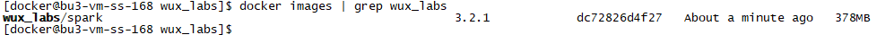
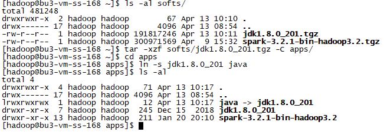

# 实验2 Spark Standalone模式搭建

本实验主要是搭建Standalone模式的Spark集群。

本实验需要先完成 [实验1 Spark Local模式搭建](实验1 Spark Local模式搭建.md)。

本实验基于Docker镜像进行集群环境搭建，Docker镜像制作完成后，即可启动任意数量的容器来启动集群。

开始实验之前，请确保服务器上安装了Docker环境，创建了docker用户。

## 任务1 Docker 镜像制作

### 步骤1 制作 Dockerfile 文件

环境说明：

* 使用centos作为底层系统
* 需要配置节点之间的免密登录，所以需要安装ssh服务
* 为了减小镜像的体积，镜像以及启动的容器内并不直接安装相关软件，而是将相关软件安装在宿主机，并将宿主机的安装路径挂载到容器，所以要求 `容器内的路径与宿主机的路径完全保持一致` 。因为宿主机的Spark使用 `hadoop` 用户安装在 `/home/hadoop/apps` 路径下，所以，Docker容器同样使用 `hadoop` 用户，并创建挂载点 `/home/hadoop/apps` 用于挂载宿主机的路径。
* 容器内的部署用户使用 `hadoop` 用户，并配置节点间的免密登录。
* 为用户配置好相关的环境变量
* 创建挂载点 `~/apps` 用于挂载安装程序，创建预留挂载点 `~/logs` 用于存放日志文件、`~/works` 用于程序运行的工作目录、`~/softs` 用于存放一些需要提交到容器内部进行安装、运行的程序。

创建Dockerfile文件`SparkStandalone`：

```
FROM centos:centos7.6.1810

MAINTAINER wux_labs wux_labs@outlook.com

# 安装sshd服务
RUN mkdir /var/run/sshd

RUN yum -y install net-tools openssl openssh-server openssh-clients which sudo

RUN sed -i 's/#PermitRootLogin yes/PermitRootLogin yes/g' /etc/ssh/sshd_config
RUN sed -i 's/#RSAAuthentication yes/RSAAuthentication yes/g' /etc/ssh/sshd_config
RUN sed -i 's/#PubkeyAuthentication yes/PubkeyAuthentication yes/g' /etc/ssh/sshd_config

RUN ssh-keygen -t dsa -f /etc/ssh/ssh_host_dsa_key
RUN ssh-keygen -t rsa -f /etc/ssh/ssh_host_rsa_key
RUN ssh-keygen -t ecdsa -b 256 -f /etc/ssh/ssh_host_ecdsa_key
RUN ssh-keygen -t ed25519 -b 256 -f /etc/ssh/ssh_host_ed25519_key

RUN echo "root   ALL=(ALL)     ALL" >> /etc/sudoers

# 创建用户和组
RUN groupadd hadoop
RUN useradd -g hadoop hadoop

USER hadoop

# 为hadoop用户设置节点间的免密登录
RUN ssh-keygen -t rsa -f ~/.ssh/id_rsa
RUN cp ~/.ssh/id_rsa.pub ~/.ssh/authorized_keys

# 配置环境变量
RUN echo $'export JAVA_HOME=/home/hadoop/apps/java\n\
export SPARK_HOME=/home/hadoop/apps/spark\n\
export PATH=$JAVA_HOME/bin:$SPARK_HOME/bin:$SPARK_HOME/sbin:$PATH\n\
' >> ~/.bashrc

RUN mkdir -p ~/apps ~/logs ~/softs ~/works
VOLUME ["/home/hadoop/apps","/home/hadoop/logs","/home/hadoop/softs","/home/hadoop/works"]

USER root

# 容器一运行就启动sshd服务
CMD ["/usr/sbin/sshd","-D"]
```


### 步骤2 构建 Docker 镜像

执行以下命令，通过Dockerfile构建镜像：

```
docker build --no-cache -f SparkStandalone -t wux_labs/spark:3.2.1 .

docker images | grep wux_labs
```



## 任务2 宿主机环境配置

由于环境采用的是挂载宿主机文件的方式，所以宿主机的文件结构需要与容器内的结构匹配。

我们首先看看宿主机当前的 `/home/hadoop/apps` 路径下的内容。

```
ls -al apps
```

可以看到，目前apps下只有spark的安装程序。


### 步骤1 创建java链接

由于Docker镜像指定了

```
export JAVA_HOME=/home/hadoop/apps/java
```

所以需要在宿主机的 `/home/hadoop/apps` 目录下创建 `java` 目录，并将 Java 8+ 安装在该目录下。由于宿主机本身就安装了 Java 8+，所以我们不需要重复安装，通过以下命令创建一个软链接指向Java安装路径即可。

```
ln -s /usr/local/jdk1.8.0_201 apps/java
```



### 步骤2 创建spark链接

由于Docker镜像指定了

```
export SPARK_HOME=/home/hadoop/apps/spark
```

所以需要在宿主机的 `/home/hadoop/apps` 目录下创建 `spark` 目录，并将Spark程序安装在该目录下。同样，由于宿主机已经安装好了Spark，所以我们不需要重复安装，通过以下命令创建一个软链接指向Spark安装路径即可。

```
ln -s /usr/local/jdk1.8.0_201 apps/java
```


### 步骤3 配置Standalone配置文件

