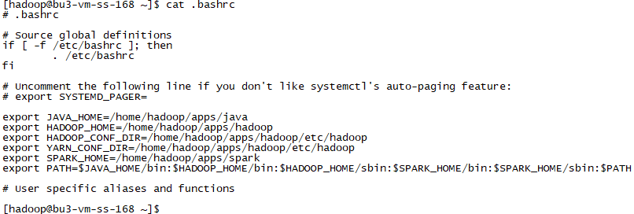
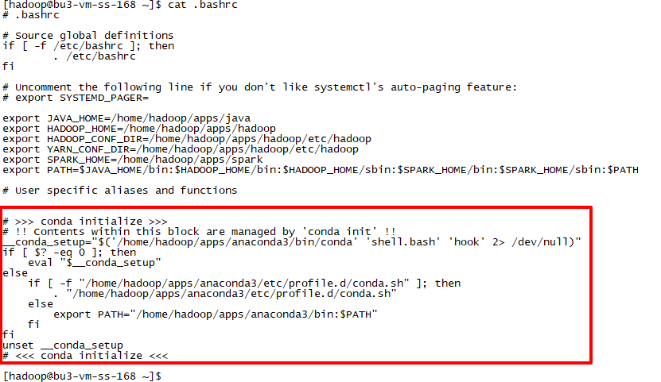

# 实验3 Spark on Yarn模式搭建

本实验主要是搭建Spark on Yarn模式的Spark集群。

本实验需要先完成 [实验2 Spark Standalone模式搭建](实验2 Spark Standalone模式搭建.md)。

本实验基于Docker镜像进行集群环境搭建，Docker镜像制作完成后，即可启动任意数量的容器来启动集群。

开始实验之前，请确保服务器上安装了Docker环境，创建了docker用户。

## 环境规划

本次实验采用5个Docker容器进行集群搭建，并且需要保证5个容器在同一个网络内。

| 容器名称 | 容器IP       |
| -------- | ------------ |
| node1    | 172.24.0.101 |
| node2    | 172.24.0.102 |
| node3    | 172.24.0.103 |
| node4    | 172.24.0.104 |
| node5    | 172.24.0.105 |

## 任务1 宿主机上安装Hadoop程序

**以下步骤需要在宿主机上使用 `hadoop` 用户进行操作。**

### 步骤1 下载Hadoop安装包

Spark 3.2.1基于Hadoop 3.2/3.3 +，所以我们下载Hadoop 3.3 的版本。


通过官方网站[https://hadoop.apache.org/releases.html](https://hadoop.apache.org/releases.html)下载安装程序。


或者直接通过下载链接[https://dlcdn.apache.org/hadoop/common/hadoop-3.3.2/hadoop-3.3.2.tar.gz](https://dlcdn.apache.org/hadoop/common/hadoop-3.3.2/hadoop-3.3.2.tar.gz)进行下载。

国内镜像可使用[https://mirrors.tuna.tsinghua.edu.cn/apache/hadoop/common/hadoop-3.3.2/hadoop-3.3.2.tar.gz](https://mirrors.tuna.tsinghua.edu.cn/apache/hadoop/common/hadoop-3.3.2/hadoop-3.3.2.tar.gz)进行下载。

将下载好的安装程序放置到softs目录下。


### 步骤2 安装Hadoop

解压安装程序、创建软链接。

```
tar -xzf softs/hadoop-3.3.2.tar.gz -C apps/
cd apps
ln -s hadoop-3.3.2 hadoop
```


在 `.bashrc` 文件中配置环境变量。

```
export JAVA_HOME=/home/hadoop/apps/java
export HADOOP_HOME=/home/hadoop/apps/hadoop
export SPARK_HOME=/home/hadoop/apps/spark
export PATH=$JAVA_HOME/bin:$HADOOP_HOME/bin:$HADOOP_HOME/sbin:$SPARK_HOME/bin:$SPARK_HOME/sbin:$PATH
```


### 步骤3 配置Hadoop

#### 配置 hadoop-env.sh

```
export JAVA_HOME=/home/hadoop/apps/java
export HADOOP_HOME=/home/hadoop/apps/hadoop
export HADOOP_CONF_DIR=/home/hadoop/apps/hadoop/etc/hadoop
export HADOOP_LOG_DIR=/home/hadoop/logs
```

#### 配置 core-site.xml

```
<configuration>
    <property>
      <name>fs.defaultFS</name>
      <value>hdfs://node1:8020</value>
    </property>
    <property>
      <name>hadoop.tmp.dir</name>
      <value>/home/hadoop/works/temp</value>
    </property>
    <property>
      <name>hadoop.proxyuser.hadoop.hosts</name>
      <value>*</value>
    </property>
    <property>
      <name>hadoop.proxyuser.hadoop.groups</name>
      <value>*</value>
    </property>
</configuration>
```

#### 配置 hdfs-site.xml

```
<configuration>
    <property>
        <name>dfs.replication</name>
        <value>3</value>
    </property>
    <property>
      <name>dfs.namenode.name.dir</name>
      <value>/home/hadoop/works/hdfs/name</value>
    </property>
    <property>
      <name>dfs.datanode.data.dir</name>
      <value>/home/hadoop/works/hdfs/data</value>
    </property>
</configuration>
```

#### 配置 mapred-site.xml

```
<configuration>
    <property>
        <name>mapreduce.framework.name</name>
        <value>yarn</value>
    </property>
</configuration>
```

#### 配置 yarn-site.xml

```
<configuration>
    <property>
      <name>yarn.nodemanager.aux-services</name>
      <value>mapreduce_shuffle</value>
    </property>
      <property>
        <name>yarn.resourcemanager.hostname</name>
        <value>node1</value>
    </property>
</configuration>
```

#### 配置 workers

```
node1
node2
node3
node4
node5
```

### 步骤4 配置Spark

Spark on Yarn是不需要启动Spark的，所以Spark的配置大多数都是可以省略的，但是我们需要告诉Spark去哪里找Yarn，所以需要为Spark配置HADOOP_CONF_DIR和YARN_CONF_DIR。

#### 配置 spark-env.sh

```
HADOOP_CONF_DIR=/home/hadoop/apps/hadoop/etc/hadoop
YARN_CONF_DIR=/home/hadoop/apps/hadoop/etc/hadoop
```

## 任务2 宿主机上安装Anaconda程序

**以下步骤需要在宿主机上使用 `hadoop` 用户进行操作。**

### 步骤1 下载Anaconda安装包

通过官方网站[https://www.anaconda.com/products/distribution#Downloads](https://www.anaconda.com/products/distribution#Downloads)下载安装程序，选择适合的系统。


或者直接通过下载链接[https://repo.anaconda.com/archive/Anaconda3-2021.11-Linux-x86_64.sh](https://repo.anaconda.com/archive/Anaconda3-2021.11-Linux-x86_64.sh)进行下载。

将下载好的安装程序放置到softs目录下。


### 步骤2 安装Anaconda

#### 安装软件

直接执行命令进行安装。

```
sh softs/Anaconda3-2021.11-Linux-x86_64.sh
```

按照安装步骤执行，并在适当的适合输入适当的值。

```
Welcome to Anaconda3 2021.11

In order to continue the installation process, please review the license
agreement.
# 这里要求查看用户协议，查看即可
Please, press ENTER to continue
>>> 
# 这里看完了用户协议，需要同意才能继续
Do you accept the license terms? [yes|no]
[no] >>> yes
# 这里根据我们自己的环境规划，指定Anaconda的安装目录/home/hadoop/apps/anaconda3
Anaconda3 will now be installed into this location:
/home/hadoop/anaconda3

  - Press ENTER to confirm the location
  - Press CTRL-C to abort the installation
  - Or specify a different location below

[/home/hadoop/anaconda3] >>> /home/hadoop/apps/anaconda3
PREFIX=/home/hadoop/apps/anaconda3
Unpacking payload ...
```

安装完成以后，会有如下提示，告诉我们已经安装完成并询问我们是否需要初始化。

```
installation finished.
Do you wish the installer to initialize Anaconda3
by running conda init? [yes|no]
[no] >>> 
```

这里我们先停一下，不明白是否要进行初始化的话，可以先看看官方文档[https://docs.anaconda.com/anaconda/install/linux/](https://docs.anaconda.com/anaconda/install/linux/)。


官网介绍，如果选择“no”不进行初始化，则不会修改我们的shell脚本，并且后续可以通过执行`conda init`来完成初始化。我们不难猜测，这个初始化应该是为我们添加环境变量、环境配置。并且官方建议选择“yes”。

先来看看当前的环境配置文件。

```
cat .bashrc
```



```
cat .bash_profile
```


在安装界面输入yes并继续。

```
installation finished.
Do you wish the installer to initialize Anaconda3
by running conda init? [yes|no]
[no] >>> yes
```


可以看到，安装程序告诉我们：

* 安装成功了
* 为我们修改了 /home/hadoop/.bashrc
* 如果不想在一启动就激活base环境，可以用`conda config --set auto_activate_base false`命令禁用

我们看看/home/hadoop/.bashrc发生了什么改变。



可以看到配置文件中多出了一段初始化配置。

当我们退出并重新登录到系统，会自动激活base环境。


#### 配置国内镜像

Anaconda虽然集成了很多Python库，但是我们有时候还是需要自己安装一些库，为了加快下载速度，可以配置国内镜像加速。

编辑文件`~/.condarc`

```
channels:
  - defaults
show_channel_urls: true
default_channels:
  - https://mirrors.tuna.tsinghua.edu.cn/anaconda/pkgs/main
  - https://mirrors.tuna.tsinghua.edu.cn/anaconda/pkgs/r
  - https://mirrors.tuna.tsinghua.edu.cn/anaconda/pkgs/msys2
custom_channels:
  conda-forge: https://mirrors.tuna.tsinghua.edu.cn/anaconda/cloud
  msys2: https://mirrors.tuna.tsinghua.edu.cn/anaconda/cloud
  bioconda: https://mirrors.tuna.tsinghua.edu.cn/anaconda/cloud
  menpo: https://mirrors.tuna.tsinghua.edu.cn/anaconda/cloud
  pytorch: https://mirrors.tuna.tsinghua.edu.cn/anaconda/cloud
  pytorch-lts: https://mirrors.tuna.tsinghua.edu.cn/anaconda/cloud
  simpleitk: https://mirrors.tuna.tsinghua.edu.cn/anaconda/cloud
```


配置完成后，可以用以下命令来查看是否生效。

```
conda info
```


### 步骤3 创建虚拟环境

Anaconda安装完成以后，我们单独创建一个虚拟环境，用来跟其他环境隔离。

```
conda create -n pyspark python=3.9
```

并且激活新创建的虚拟环境。

```
conda activate pyspark
```


安装依赖的库。

```
pip install pyspark pyhive pymysql jieba -i https://pypi.tuna.tsinghua.edu.cn/simple
```


## 任务3 Docker 镜像制作

### 步骤1 制作 Dockerfile 文件

**以下步骤需要在宿主机上使用 `docker` 用户进行操作。**

环境说明：

* 在 [实验2 Spark Standalone模式搭建](实验2 Spark Standalone模式搭建.md) 已完成的 `SparkStandalone` 的基础上，添加Hadoop、Anaconda的环境变量配置。

创建Dockerfile文件`SparkOnYarn`：

> 与实验2中的SparkStandalone相比，SparkOnYarn多了以下几项：
>
> * Hadoop相关的环境变量：HADOOP_HOME、HADOOP_CONF_DIR、YARN_CONF_DIR
> * Python相关的环境变量：PYSPARK_PYTHON
> * Anaconda的初始化脚本和镜像加速配置

```
FROM centos:centos7.6.1810

MAINTAINER wux_labs wux_labs@outlook.com

# 安装sshd服务
RUN mkdir /var/run/sshd

RUN yum -y install net-tools openssl openssh-server openssh-clients which sudo

RUN sed -i 's/#PermitRootLogin yes/PermitRootLogin yes/g' /etc/ssh/sshd_config
RUN sed -i 's/#RSAAuthentication yes/RSAAuthentication yes/g' /etc/ssh/sshd_config
RUN sed -i 's/#PubkeyAuthentication yes/PubkeyAuthentication yes/g' /etc/ssh/sshd_config

RUN ssh-keygen -t dsa -f /etc/ssh/ssh_host_dsa_key
RUN ssh-keygen -t rsa -f /etc/ssh/ssh_host_rsa_key
RUN ssh-keygen -t ecdsa -b 256 -f /etc/ssh/ssh_host_ecdsa_key
RUN ssh-keygen -t ed25519 -b 256 -f /etc/ssh/ssh_host_ed25519_key

RUN echo "root   ALL=(ALL)     ALL" >> /etc/sudoers

# 创建用户和组
RUN groupadd hadoop
RUN useradd -g hadoop hadoop

USER hadoop

# 为hadoop用户设置节点间的免密登录
RUN ssh-keygen -t rsa -f ~/.ssh/id_rsa
RUN cp ~/.ssh/id_rsa.pub ~/.ssh/authorized_keys

# 配置环境变量
RUN echo $'export JAVA_HOME=/home/hadoop/apps/java\n\
export HADOOP_HOME=/home/hadoop/apps/hadoop\n\
export HADOOP_CONF_DIR=/home/hadoop/apps/hadoop/etc/hadoop\n\
export YARN_CONF_DIR=/home/hadoop/apps/hadoop/etc/hadoop \n\
export SPARK_HOME=/home/hadoop/apps/spark\n\
export PYSPARK_PYTHON=/home/hadoop/apps/anaconda3/envs/pyspark/bin/python3\n\
export PATH=$JAVA_HOME/bin:$HADOOP_HOME/bin:$HADOOP_HOME/sbin:$SPARK_HOME/bin:$SPARK_HOME/sbin:$PATH\n\
' >> ~/.bashrc

# 配置Anaconda的初始化配置
RUN echo "# >>> conda initialize >>>" >> ~/.bashrc
RUN echo "# !! Contents within this block are managed by 'conda init' !!" >> ~/.bashrc

RUN echo $'__conda_setup="$(\'/home/hadoop/apps/anaconda3/bin/conda\' \'shell.bash\' \'hook\' 2> /dev/null)"\n\
if [ $? -eq 0 ]; then\n\
    eval "$__conda_setup"\n\
else\n\
    if [ -f "/home/hadoop/apps/anaconda3/etc/profile.d/conda.sh" ]; then\n\
        . "/home/hadoop/apps/anaconda3/etc/profile.d/conda.sh"\n\
    else\n\
        export PATH="/home/hadoop/apps/anaconda3/bin:$PATH"\n\
    fi\n\
fi\n\
unset __conda_setup\
' >> ~/.bashrc
RUN echo "# <<< conda initialize <<<" >> ~/.bashrc

# 配置Anaconda的国内加速
RUN echo $'channels:\n\
  - defaults\n\
show_channel_urls: true\n\
default_channels:\n\
  - https://mirrors.tuna.tsinghua.edu.cn/anaconda/pkgs/main\n\
  - https://mirrors.tuna.tsinghua.edu.cn/anaconda/pkgs/r\n\
  - https://mirrors.tuna.tsinghua.edu.cn/anaconda/pkgs/msys2\n\
custom_channels:\n\
  conda-forge: https://mirrors.tuna.tsinghua.edu.cn/anaconda/cloud\n\
  msys2: https://mirrors.tuna.tsinghua.edu.cn/anaconda/cloud\n\
  bioconda: https://mirrors.tuna.tsinghua.edu.cn/anaconda/cloud\n\
  menpo: https://mirrors.tuna.tsinghua.edu.cn/anaconda/cloud\n\
  pytorch: https://mirrors.tuna.tsinghua.edu.cn/anaconda/cloud\n\
  pytorch-lts: https://mirrors.tuna.tsinghua.edu.cn/anaconda/cloud\n\
  simpleitk: https://mirrors.tuna.tsinghua.edu.cn/anaconda/cloud' >> ~/.condarc

RUN mkdir -p ~/apps ~/logs ~/softs ~/works
VOLUME ["/home/hadoop/apps","/home/hadoop/logs","/home/hadoop/softs","/home/hadoop/works"]

USER root

# 容器一运行就启动sshd服务
CMD ["/usr/sbin/sshd","-D"]
```


### 步骤2 构建 Docker 镜像

执行以下命令，通过Dockerfile构建镜像：

```
docker build --no-cache -f SparkOnYarn -t wux_labs/spark:3.2.1 .

docker images | grep wux_labs
```


## 任务4 启动 Spark 集群

**以下步骤需要在宿主机上使用 `docker` 用户进行操作。**

配置好以上内容，就可以准备启动集群了。

### 步骤1 创建 docker-compose 文件

我们通过 docker-compose 来管理容器，所以先创建一个 docker-compose 文件`SparkOnYarn.yml`。

> 由于程序运行中的一些日志我们不需要持久化保留，所以这里就不再为log创建数据卷了，就让它保留在容器内，与容器的生命周期保持一致。
>
> Hadoop、Spark的工作空间的内容需要持久化保留，所以我们保留了work的数据卷，数据可以持久化保留下来，集群重启也不受影响。
>
> 端口都是默认端口，并映射到宿主机的端口。

```
version: '3.5'

services:
  node1:
    image: wux_labs/spark:3.2.1
    container_name: node1
    restart: always
    volumes:
      - /home/hadoop/apps:/home/hadoop/apps
      - node1_works:/home/hadoop/works
    ports:
      - 8088:8088
      - 9870:9870
    networks:
      hadoop_networks_24:
        ipv4_address: 172.24.0.101

  node2:
    image: wux_labs/spark:3.2.1
    container_name: node2
    restart: always
    volumes:
      - /home/hadoop/apps:/home/hadoop/apps
      - node2_works:/home/hadoop/works
    networks:
      hadoop_networks_24:
        ipv4_address: 172.24.0.102

  node3:
    image: wux_labs/spark:3.2.1
    container_name: node3
    restart: always
    volumes:
      - /home/hadoop/apps:/home/hadoop/apps
      - node3_works:/home/hadoop/works
    networks:
      hadoop_networks_24:
        ipv4_address: 172.24.0.103

  node4:
    image: wux_labs/spark:3.2.1
    container_name: node4
    restart: always
    volumes:
      - /home/hadoop/apps:/home/hadoop/apps
      - node4_works:/home/hadoop/works
    networks:
      hadoop_networks_24:
        ipv4_address: 172.24.0.104

  node5:
    image: wux_labs/spark:3.2.1
    container_name: node5
    restart: always
    volumes:
      - /home/hadoop/apps:/home/hadoop/apps
      - node5_works:/home/hadoop/works
    networks:
      hadoop_networks_24:
        ipv4_address: 172.24.0.105

networks:
  hadoop_networks_24:
    driver: bridge
    ipam:
      config:
        - subnet: 172.24.0.0/24

volumes:
  node1_works:
    driver: local
  node2_works:
    driver: local
  node3_works:
    driver: local
  node4_works:
    driver: local
  node5_works:
    driver: local
```

### 步骤2 启动容器

```
docker-compose -f SparkOnYarn.yml up -d

docker ps
```


这样我们就启动了5个Docker容器，但是到目前为止，Spark集群还未启动。

### 步骤3 启动 Yarn 集群

Docker容器启动成功，此时我们需要使用 `hadoop` 用户进入到 node1 容器的内部，启动 Yarn 集群。

```
docker exec -it -u hadoop node1 /bin/bash
```


> 可以看到，即便是在容器内，我们一登录就自动激活了Anaconda的base环境。

#### 格式化 namenode

**这个步骤仅执行一次**

我们可以先看一下目前的目录结构。


执行命令进行格式化。

```
hdfs namenode -format
```

再来看看目录结构。


#### 启动Yarn集群

然后执行启动命令。

> 虽然Hadoop和Spark的sbin目录下都有start-all.sh脚本，但是由于我们在环境变量PATH里面Hadoop的配置在前面，所以按顺序优先找到Hadoop的start-all.sh，从而会正确启动HDFS和Yarn。
>
> 否则，请使用命令的绝对路径执行，或者切换到命令所在目录执行。

```
start-all.sh
```


这样我们就完成了Yarn集群的启动。

来看看现在的进程。

```
jps
```


可以看看，各个节点都启动了对应的角色，重要角色都集中在node1上。

## 任务5 测试 Spark on Yarn 模式

测试？我们好像还没启动Spark吧？

是的！Spark on Yarn模式下，只需要启动Yarn，不需要专门启动Spark！

### 步骤1 测试 HDFS

我们在Hadoop的配置文件中，没有指定HDFS的Web端口，Hadoop 3默认使用的是9870，并且我们已经映射到了宿主机。打开浏览器看看。


再点点其他链接看看。


### 步骤2 测试 Yarn

我们可以通过端口 8088 打开Yarn的Web UI。


点点其他链接看看。


### 步骤3 测试 spark-shell

我们在宿主机上执行 spark-shell ，此时，我们需要指定 --master 选项，以让 spark-shell 连接到集群环境。

```
cd /home/hadoop/apps/spark

bin/spark-shell --master yarn --deploy-mode client
```


可以看到，master = yarn。并且，在启动的过程中，Yarn会从`spark.yarn.jars`和`spark.yarn.archive`去加载Spark的包，但是我们都没有配置，所以Yarn从`SPARK_HOME`下加载的Spark相关的包。

在Yarn的界面，我们可以看到提交的程序。


我们运行一段代码

```
scala> sc.parallelize(List(1,2,3,4,5)).map(x => x * 2).collect()
```


通过点击 Web UI 界面的 Application ID 可以跳转到应用的界面。


通过点击ApplicationMaster可以跳转到Spark的Master界面。


在这里，我们可以看到，宿主机作为Driver，Docker容器作为Executor，并且我们虽然有5个节点，但本次任务的运行仅占用了其中的2个（对应node1和node3）。


> 由于是采样的Docker容器运行，本地计算机无法直接访问容器，仅宿主机可以访问容器。
>
> 所以本地计算机只能查看做了端口映射的 8088、9870的内容。
>
> 一旦涉及到需要访问其他节点的，比如：查看Executor 1、2上的日志，通过Web界面就无法查看了。
>
> 所以，我们只能尽量让宿主机或node1作为Driver，并且只能查看宿主机或node1的日志。

### 步骤3 测试 spark-submit

我们在宿主机上执行 spark-submit ，此时，我们需要指定 --master 选项，以让 spark-submit 连接到集群环境。

#### Client 模式

在执行时指定 `--deploy-mode client`

```
bin/spark-submit --master yarn --deploy-mode client --class org.apache.spark.examples.SparkPi examples/jars/spark-examples_2.12-3.2.1.jar 10
```


我们可以在 Yarn 的 Web UI 界面看到我们的应用。


通过History链接，可以查看任务的执行情况。


我们可以通过Web UI发现，当前无法显示Master节点，因为宿主机作为客户端，不属于Yarn集群节点，所以显示不出来。


#### Cluster 模式

在执行时指定 `--deploy-mode cluster`

```
bin/spark-submit --master yarn --deploy-mode cluster --class org.apache.spark.examples.SparkPi examples/jars/spark-examples_2.12-3.2.1.jar 10
```


可以看到，这种模式下的日志明显减少了很多，并且也没有看到最终的计算结果输出。


这是因为宿主机不再承担Driver角色，日志自然就不会在宿主机打印，而是在真正的Driver节点打印。

但是通过Yarn Web UI还是可以看到我们的应用的。


我们可以通过Web UI发现，当前Master节点，因为Yarn是从当前集群中挑选一个节点作为Master节点启动Driver程序的（当前程序对应的是node4）。


### 步骤4 测试 pyspark

我们在宿主机上执行 pyspark ，此时，我们需要指定 --master 选项，以让 pyspark 连接到集群环境。

```
bin/pyspark --master yarn --deploy-mode client
```


可以看到，master = yarn。并且我们可以在 Yarn Web UI 界面看到我们的应用。


我们执行一段代码。

```
>>> sc.parallelize([1,2,3,4,5]).map(lambda x: x + 1).collect()
```

